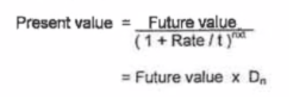
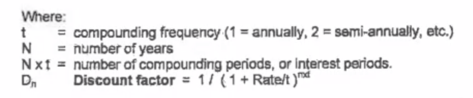

# 债券交易系统

## 2-29

1. 信用评级根据一个国家的历史情况和经济情况。做过一次老赖信用就会下降很多，下降评级。国家评级下降会再影响经济，比方说借贷产生困难。

2. 学以致用，用英语。

3. 算利率有两类算法

   - simple interest
   - compound interest

4. risk free interest

5. 有限责任公司——公司破产了，公司相关负责人负责有限。

6. PV FV 的用途：pricing & invement decision

   计算方式：componding and discounting

   

   

7. 债券就是IOU——I owe you

8. 债券发行价为100

   现金流量图，将未来所有的现金都画下来

9. loan deposit mortgage

几个任务：温故而知新、example 花呗分期付款的问题 讲一些例子。苹果手机巴拉巴拉