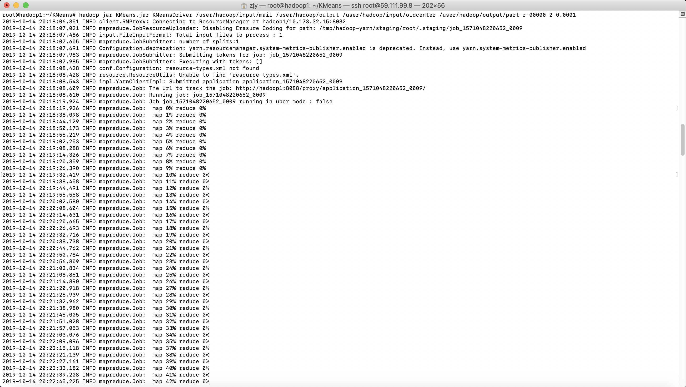
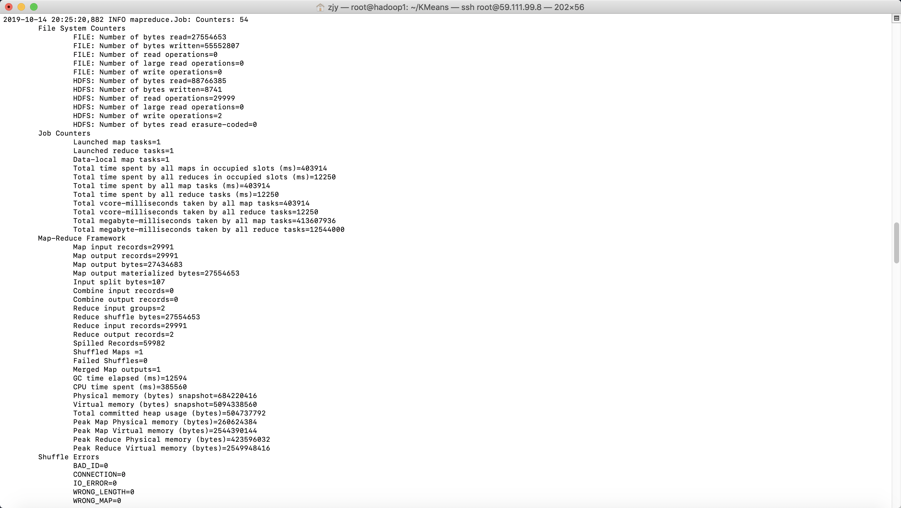

MENIFEST.MF

```markdown
Manifest-Version: 1.0
Main-Class: KMeansDriver
```


编译

```java
javac *.java
jar -cvf KMeans.jar MENIFEST.MF *.class
```


```java
hadoop jar KMeans.jar KMeansDriver /user/hadoop/input/mail /user/hadoop/output /user/hadoop/input/oldcenter /user/hadoop/output/part-r-00000 2 0.0001
```







一个节点运行时间：

二个节点运行时间：

三个节点运行时间：

三个节点运行时间：


```java
hdfs dfs -get /user/hadoop/output/part-r-00000
  
```

