# HW4 PageRank on Spark 

## 0 作业说明

 In this homework, you are asked to deploy Apache SPARK on the Cloud and write a simple pagerank algorithm. The dataset is the network topology data for Stanford University. Each line of the file follows the format of (id, neighbor id). 

Below is an example implementation for a network with (A, B, C, D) four nodes. Please compare the performance with 1, 2, 3, 4, 5 nodes cluster. Compared to Hadoop, does spark show a better performance?

##  1 Spark安装部署

### 1.1 安装scala

在scala官网下载相应的scala包，本小组下载的版本为2.13.1，将scala解压并安装，用`scala -version`命令查看当前scala的版本信息，截图如下：


在/etc/profile里配置scala的环境变量：

```
export SCALA_HOME=/usr/local/scala-2.13.1
export PATH=$SCALA_HOME/bin:$PATH
```

使用`source`指令使配置文件立即生效，然后运行scala，运行结果截图如下：


对其他的节点用相同的方式进行配置。


### 1.2 安装Spark

下载与hadoop版本对应的Spark，本小组下载的版本为，将Spark解压，在/etc/profile里配置Spark的环境变量：

```
export SPARK_HOME=/usr/local/spark-3.0.0-preview-bin-hadoop3.2
export PATH=.:$JAVA_HOME/bin:${SCALA_HOME}/bin:${SPARK_HOME}/bin:${HADOOP_HOME}/bin:$PATH
```

使用`source`指令使配置文件立即生效，然后执行`spark-shell`脚本，运行结果截图如下：

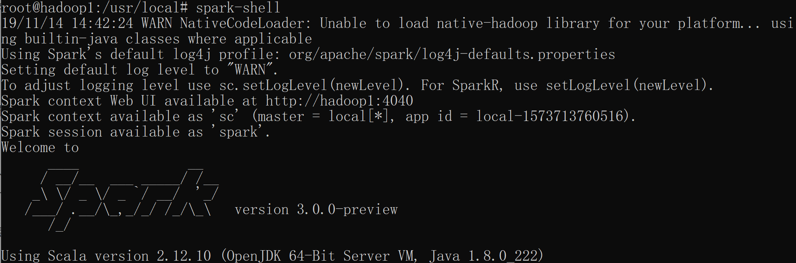

### 1.3 对master进行相应的配置

将hadoop1配置为master节点，进入spark目录里的conf文件夹下，首先将spark-env.sh.template文件cp为spark-env.sh，然后添加配置项：

```
export JAVA_HOME=/usr/lib/jvm/default-java/
export SCALA_HOME=/usr/local/scala-2.13.1
export HADOOP_HOME=/usr/local/hadoop

export STANDALONE_SPARK_MASTER_HOST=hadoop1
export SPARK_MASTER_IP=$STANDALONE_SPARK_MASTER_HOST

export SPARK_LIBRARY_PATH=${SPARK_HOME}/lib
export SCALA_LIBRARY_PATH=${SCALA_HOME}/lib
```

将slaves.template文件cp为slaves，在其中加入三个worker节点：（不知道本机到底要不要加进去）

```
hadoop2
hadoop3
hadoop4
```

### 1.4 分发到其他三个节点

master节点配置完成以后，将spark的整个包scp到另外三个节点上，spark的路径和master上的spark路径保持一致，分别在另外三个节点执行`spark-shell`，运行截图如下：


hadoop3和hadoop4的运行截图相同，此处省略。

### 1.5 启动Spark集群

在master节点上，cd到spark里的sbin目录，执行`strat-all.sh`脚本，shell输出截图如下：

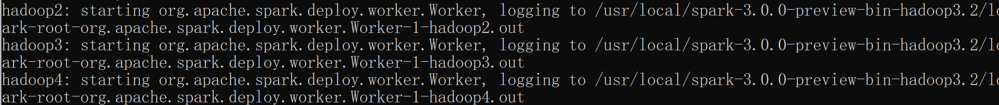

使用`jps`查看信息，输出结果如下：

master节点：

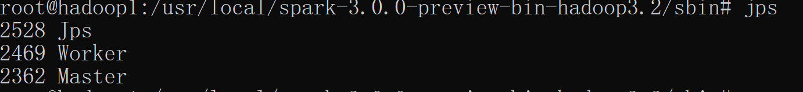

slave节点：


### 1.6 查看集群状态

在spark集群的默认web管理页面http://masterip:8080上查看一下页面：

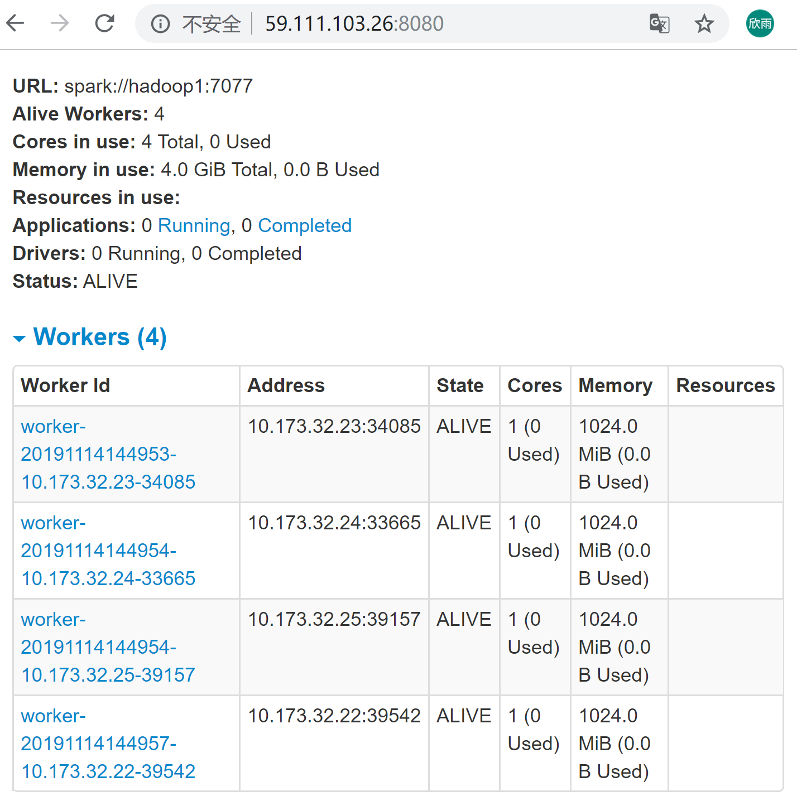

可以看出，集群有四个worker，而且现在都处于正常工作状态。

### 1.7 运行一个spark样例代码

在./examples/src/main目录下有一些Spark的实例程序。先运行一个示例程序，执行如下命令：

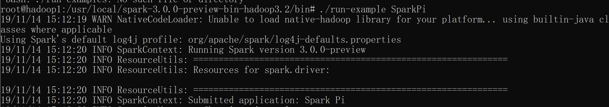

shell的输出如下：


通过测试代码，可以发现相比于MapReduce，spark的速度快很多。

### 1.8 关闭spark集群

cd到spark目录下的sbin目录，然后执行`stop-all.sh`脚本。


# 2 PageRank算法

## 2.1 概述

PageRank，即网页排名，是谷歌早期构建搜索系统原型提出的链接分析算法。通过分析所有网页的入链，获得网页的重要性：网页入链的数量越多，入链质量越高，则网页的重要性越高。

## 2.2 分析

1. 初始化

   通过链接关系构建web图：网络中的每个页面对应web图中的一个顶点；若网页A包含一条指向网页B的链接，则web图中存在一条有顶点A指向顶点B的边；web图中每个顶点的PR值初始化为1/N（N为网页个数）。

2. 迭代计算

   假设从一个网页通过链接跳转到另一个网页的概率相同。在每一轮迭代中，将每个网页当前的PR值平均分配到该网页的链接上，再重新计算每个网页上的的PR值。

3. 结束迭代

   当每个网页的PR值固定不变，或者收敛到某一个范围内时，结束迭代，获得每个网页的最终PR值。

## 2.3 程序

删除web-Stanford.txt文件中readme部分，留下网页链接部分，如下图：

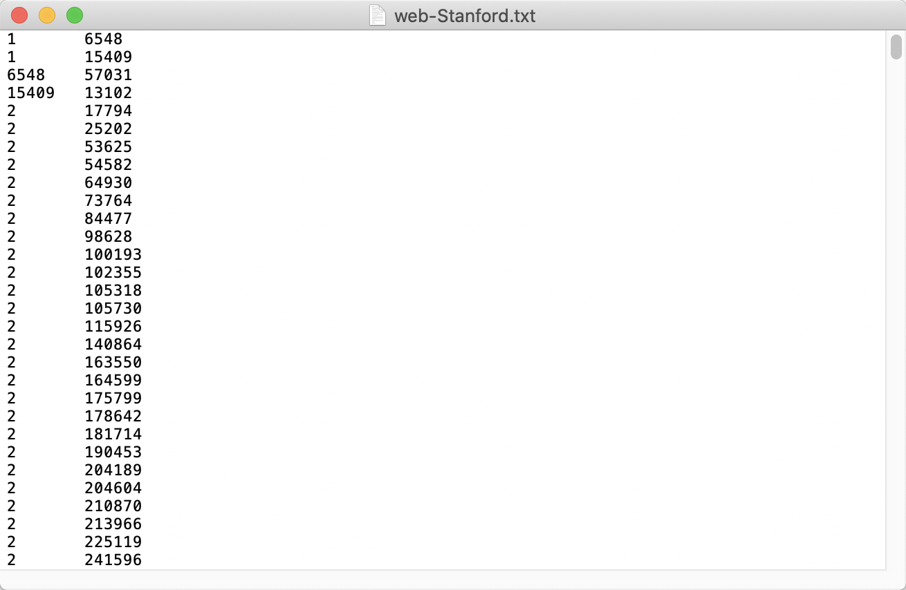

下载并安装Scala sbt。

编写sbt文件：

```makefile
version := "1.0"
scalaVersion := "2.12.1"
libraryDependencies += "org.apache.spark" %% "spark-core" % "2.4.4"
```

pagerank程序：

```scala
import scala.io.Source
import org.apache.spark.{HashPartitioner, SparkConf, SparkContext}

object PageRank {

	def main(args: Array[String]): Unit = {
		val conf = new SparkConf().setAppName("PageRank").setMaster("local")
		val sc = new SparkContext(conf)

		val filePath : String = "input/web-Stanford.txt"
		val webLink = sc.textFile(filePath).map { 
			case(line) => {
				val arr = line.split("\t")
				(arr(0).toString, List(arr(1)))
			}
		}
		val webLink2 = sc.textFile(filePath).map { 
			case(line) => {
				val l: List[String] = List()
				val arr = line.split("\t")
				(arr(1).toString, l)
			}
		}
		val links = (webLink.union(webLink2))
		.reduceByKey{
			case(x,y) => {
				x:::y
			}
		}
		//Define alpha
		val alpha = 0.85
		val iterCnt = 20
		//Init pageRanks
		var ranks = links.map {
			case(start, end) => (start+"", 1.0)
		}
		//Iteration
		for(i <- 0 until iterCnt) {
			val contributions = links.join(ranks).flatMap{
				case(_, (linklist, rank)) =>
					linklist.map(dest => (dest, rank / linklist.size))
			}
			ranks = contributions.reduceByKey((x, y) => x + y)
				.map{
					case(web, v) => (web+"", (1 - alpha) + alpha * v)
			}
		}
		//Display final pageRanks
		ranks.sortByKey().foreach(println)
		ranks.coalesce(1).saveAsTextFile("output")
	}
}
```

在终端输入sbt和run，编译运行pagerank程序。

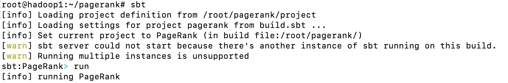

中间过程打印：

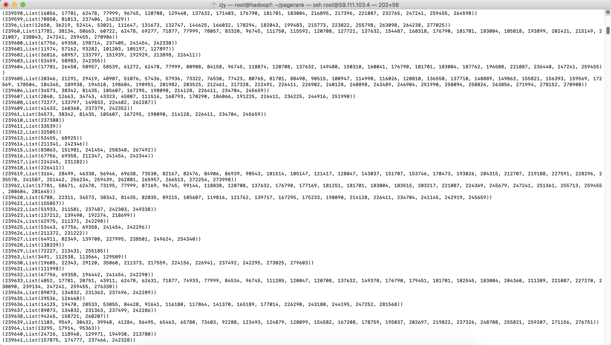

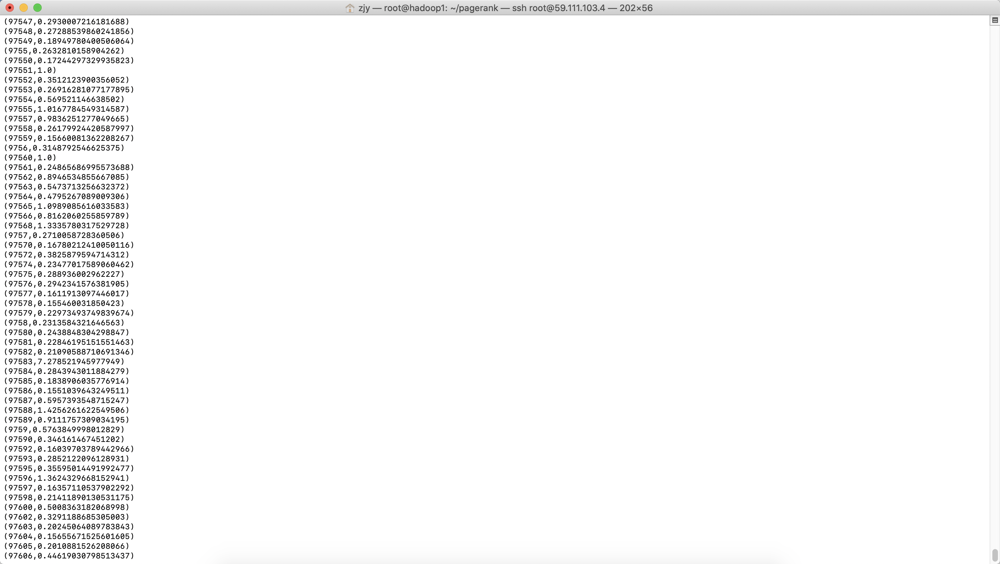

最后网页PR值计算的输出结果：

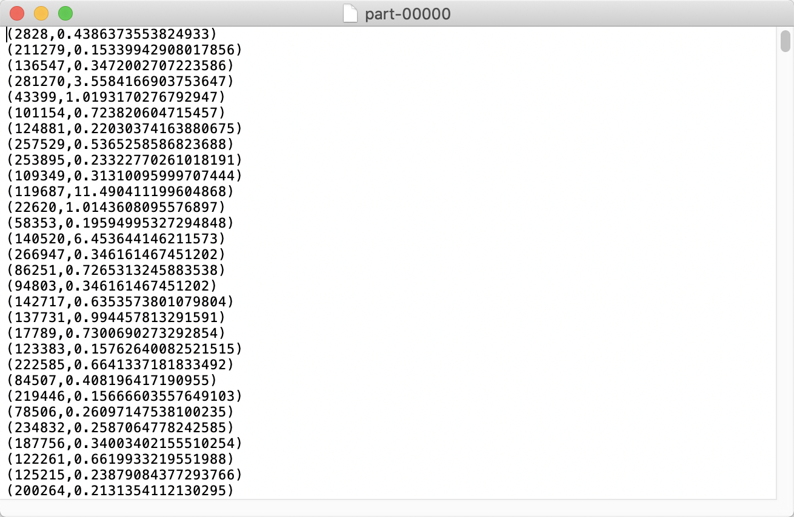

# 3 分析效率

## 3.1 服务器配置

n1, 2核 4GB

## 3.2 时间效率

在1，2，3，4，5个节点集群的spark下运行pagerank算法。

关闭正在运行的spark节点集群。进入spark目录里的conf文件夹下修改slaves。例如，修改为

```makefile
# A Spark Worker will be started on each of the machines listed below.
localhost
hadoop2
hadoop3
#hadoop4
```

再次开启spark节点集群，当前运行的spark节点集群为3个。

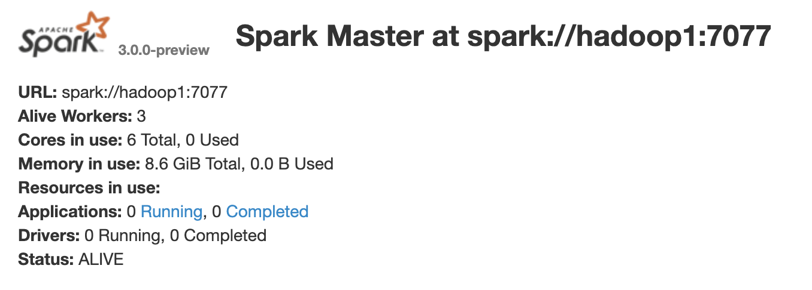

计算不同数量的spark节点集群下，运行pagerank程序需要的时间：

| **节点集群数量** | 1    | 2    | 3    | 4    | 5    |
| ---------------- | ---- | ---- | ---- | ---- | ---- |
| **时间**         | 4959 | 3592 | 3529 | 3030 | 2980 |

