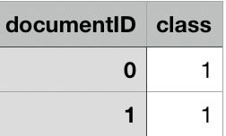

# 构建字典

将mapreduce得到的每个单词在spam和ham中出现的概率放入字典。

```python
d = dict()  # dictionary
probabilityPath = 'Probability'
resultPath = 'result.csv'
testPath = csv_path_after_preProcess
f = open(probabilityPath)  # open probability
for line in f:
    if 0 < line.split().__len__():
        key = line.split()[0]
        value = float(line.split()[1])
        d[key] = value
```

# 邮件分类

对每一封邮件，首先进行数据清洗，将得到的结果存入CSV文件中。

遍历清洗后的邮件中的每一个单词，查找字典中对应的概率`d['spam:' + word]`或`d['ham:' + word]`；如果单词不在字典中出现，就使用预先计算好的概率`d['ham:' + word]`或`d['ham']`。

计算$$ C_{NB}=arg\max_{c_j \in C}logP(c_j)+\sum_{i\in positions}logP(x_i|c_j) $$ ，统计邮件属于spam和ham的概率。

```python
if d.get('spam:' + word) is not None:
	spamProbability += math.log(d['spam:' + word])
else:
	spamProbability += math.log(d['spam'])
if d.get('ham:' + word) is not None:
	hamProbability += math.log(d['ham:' + word])
else:
	hamProbability += math.log(d['ham'])
```

比较spamProbability和hamProbability，选择大的一方，作为邮件的属性，写入CSV。

```python
if spamProbability > hamProbability:
  resultWrite.writerow([l[0], 1])
	print(1)
else:
  resultWrite.writerow([l[0], 0])
	print(0)
```

最后得到的结果是一个CSV文件，两列，第一类代表邮件ID；class代表邮件属性，class等于1代表spam，class等于0代表ham。

