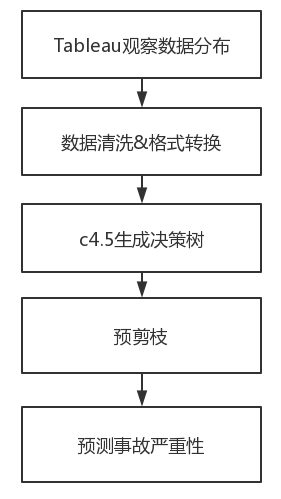
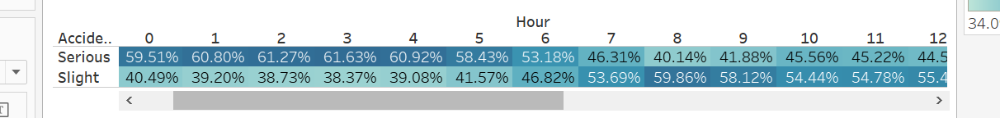
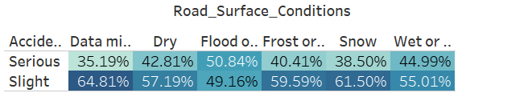
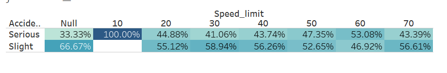
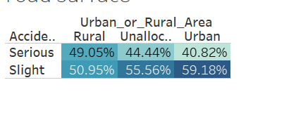
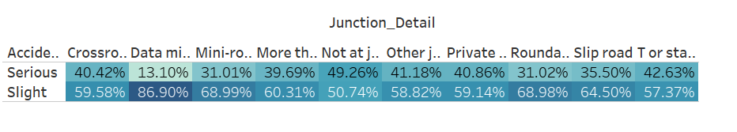
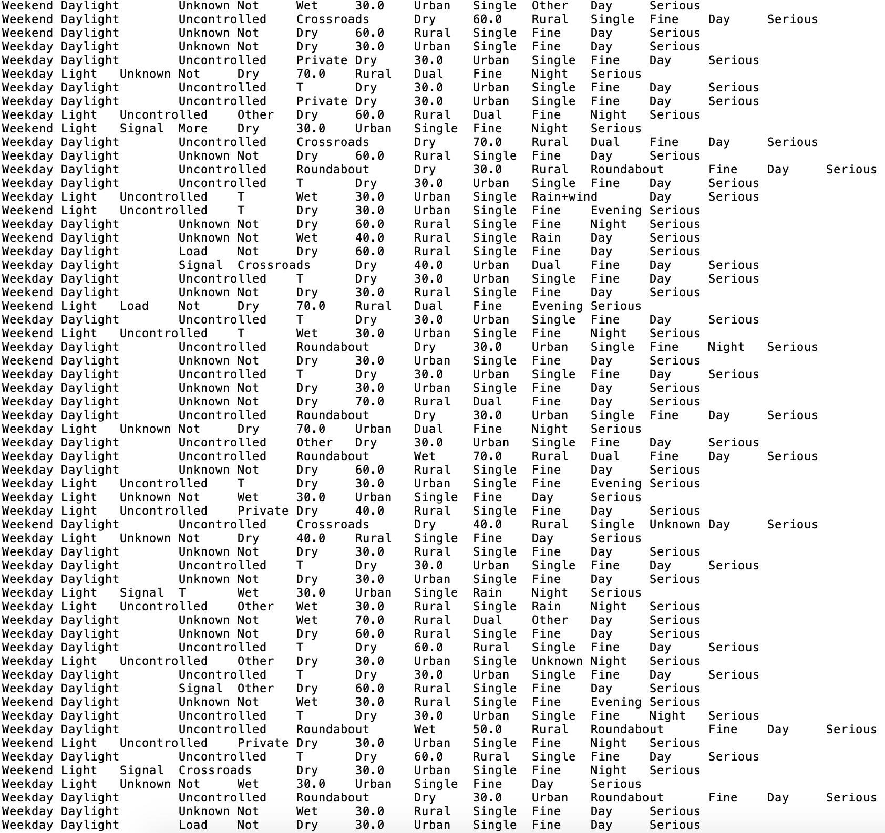
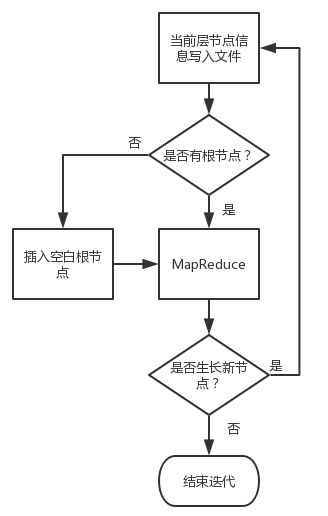
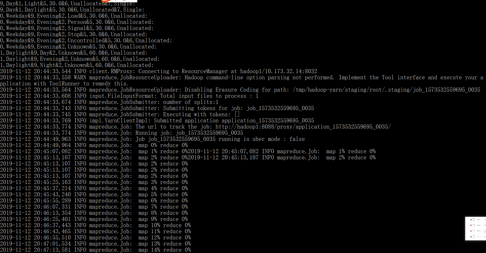
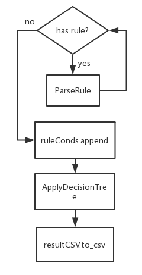

## 0.作业信息

### 0.1 简介

In this project, you will be given a traffic accident dataset (please download from the course website), which has several attributes, shown below.

Accident_Index        string

Accident_Severity       string

Date             string

Day_of_Week          string

Junction_Control       string

Junction_Detail        string

Latitude           float

Light_Conditions       string

Local_Authority_(District)  string

Longitude           float

Road_Surface_Conditions    string

Road_Type           string

Special_Conditions_at_Site  string

Speed_limit          float

Time             string

Urban_or_Rural_Area      string

Weather_Conditions      string

The second attribute is the target attribute, which has two values: Serious and Slight.

You are supposed to build a decision tree/random forest model to do the prediction for "Accident_Severity". 

Similar as before, for the evaluation, we will input a file consisting of hundreds of records. **Each line of the text represents a record and attributes of the record is split by ",". The second attribute has empty value.** You are supposed to output a file. Each line indicates the predicted "Accident_Severity" value (Serious/Slight).

Again, we will rank your answers based on the F1.

### 0.2 分工

| 成员   | 任务                         |
| ------ | ---------------------------- |
| 贺婷婷 | 数据分析处理，HADOOP代码编写 |
| 胡欣雨 | HADOOP代码编写               |
| 张佳瑶 | 剪枝+预测                    |

## 1.项目原理

决策树通过将实例从树的根部到某个叶节点进行分类来对实例进行分类，从而提供了实例的分类。 从树的根节点开始对实例进行分类，测试该节点指定的属性，然后向下移动与该属性的值相对应的树枝，如上图所示。 然后针对以新节点为根的子树重复此过程。

### 1.1.ID3

Definition of information of the event E:
$$
I(E)=\log_2\frac{1}{p(x)}=-\log_2p(x)
$$
The expected value for the information（熵）:
$$
H(x)=E(I(X))=\sum_{i}{p({x_i})I({x_i})}=-\sum_{i}p({x_i})\log_2{p({x_i})}
$$
其中$p({x_i})$表示第$i$个类别在整个训练元组出现的概率，可以用属于此类别的数量除以训练元组总数量作为估计

Conditional entropy:
$$
H(X|Y)=-\sum_{j}{p({y_j})}\sum_{i}{p({x_i}|{y_j})}\log_2{p({x_i}|{y_j})}
$$
其中$p({y_j})$表示属性$Y$的第$j$种取值在整个训练元组的概率，可以用占比来表示

${p({x_i}|{y_j})}\log_2{p({x_i}|{y_j})}$表示第$i$个类别在属性$Y$的第$j$种取值条件下的熵

Information gain:
$$
IG(X,Y)=H(X)-H(X|Y)
$$
Issues in decision trees learning:

- 出现唯一标识的属性时，算法会选择这个属性进行分裂，例如ID、日期
- 对连续值的处理

### 1.2.C4.5 

Information gain ratio:
$$
Gainratio(X,a)=\frac{Gain(X,a)}{{H_a}(X)}
$$

$$
{H_a}(X)=-\sum_{v=1}^{V}\frac{|{X_v}|}{|X|}\log_2\frac{|X_v|}{|X|}
$$

C4.5算法是对ID3算法的一种改进，相比ID3算法增加了分裂信息度量的计算，是本次project中本小组选取的算法。

### 1.3.CART

Definition:
$$
i(N)=\sum_{i\neq j}p({w_i})p({w_j})=1-\sum_{j}{p^2({w_j})}
$$

$$
Gini(D,A)=\sum_{i}{\frac{{D_i}}{D}}Gini({D_i})
$$

其中${p({w_j})}$表示某属性的某个取值下某个分类的概率，$\frac{{D_i}}{D}$表示某个属性的某个取值占总体的概率。

## 2.设计思路

首先利用Tableau进行数据可视化，观察数据分布，进行特征工程，随后利用Python进行数据清洗与格式转换，输出两个文件，attr为属性，class为分类：

Data格式：attrValue1 \t attrValue1.... \t className，attributes格式：attrName:attrValue1,attrValue2..(即值域)，最后一行为:className1,className2

综合考虑之下，本次项目使用C4.5算法，利用MapReduce对清洗后数据进行计算处理，生成决策树，最终表现为规则集的格式输出至文件，格式为attrIndex,attrValue&...:className。

考虑通过剪枝提高模型的泛化能力，由于实在是计算得太慢了，迫不得已得用上预剪枝（写报告的时候还在跑没写预剪枝的不知道能不能来得及写上），同时利用了后剪枝。



## 3.代码实现

### 3.0.主要程序

`数据预处理`

preprocess.py

predict.py


`C4.5`

Main.java                        ——驱动类

MyMapper.java			 ——Map类

MyRecuder.java             ——Reducer类

Rule.java						 ——决策树规则描述


`预测`

applyModel.py			——预测程序

F1Calculate.py			 ——准确率、召回率衡量程序

### 3.1.数据预处理

#### 3.1.1. 数据集格式

两种数据集格式，一种包含事故信息Accident_Index, Accident_Severity, Date, Junction_Control, Junction_Detail, Latitude, Light_condition, Local_Authority_(District), Longitude, Road_Surface_Conditions, Special_Conditions_at_Site, Speed_limit, Time, Urban_or_Rural_Area, Weather_Conditions

另一种包含Accident_Index, Age_Band_of_Driver, Driver_Home_Area_Type, Journey_Purpose_of_Driver, Junction_Location, Sex_of_Driver, Vehicle_Type

两张表通过索引（Accident_Index）建立关系，数据预处理的目的为：将两张表合并，**选取出其中对预测有意义的属性**，对属性的取值进行处理并输出到一个文件中。

数据文件输出格式：

> ​	attrValue1	attrValue2	...	attrValueN	label
>
> ​	若属性值为空则为null，制表符分割
>
> ​	attrValue表示记录的每个属性的取值

属性文件输出格式：

> ​	attrName1:numeric/string:attrValue1,attrValue2,...,attrValueN
>
> ​	最后一行：
>
> ​	:className1,className2,...,classNameN
>
> ​	attrValue表示该属性名称对应的所有可能取值

#### 3.1.2.处理连续值属性


所以我们分为Weekend和Weekday两种。



故根据数据分布可得，我们可以将时间段分为两段，7-19为Day，20-23为Evening，0-6为Night。缺失值中主要



保持。


光照条件可分为三类，Daylight&Darkness - lights unknown可视为Daylight, Darkness - lights lit&Darkness - lights unlit视作Light，Darkness视作Dark。



speed_limit部分分布各异，唯一需要注意的是空值我们把它填充成Unknown.





这些属性看起来各有妙处，我就不动了。Data Missing or out of range 按理说应该把相关记录删掉，但是本次数据中出现这个的概率太大了，所以干脆保留作为一种情况，通过决策树本身的训练对数据缺失进行处理。

但是，需要注意的是有些值并不是写着"Data Missing or out of range",而是确实有出现空值的情况，如时间中的“”，对于这种情况，我们根据属性的值域分布直接对数据进行数据填充以永绝后患。观察得到只有speed_limit和Time中出现了空值的情况，选择与其最相近分布的数值，Time填充为"Day",speed_limit没有分布相近的，记为“Unknown“

代码实现如下：

```python
def when_was_it(hour):
    if hour >= 7 and hour < 19:
        return "Day"
    elif hour >= 20 and hour < 23:
        return "Evening"
    else:
        return "Night"


def day_of_week(day):
    if day == "Saturday" or day == "Sunday":
        return "Weekend"
    else:
        return "Weekday"


def light_or_darkness(darkness):
    if darkness == "Daylight" or darkness == "Darkness - lights unknown":
        return "Daylight"
    elif darkness == "Darkness":
        return "Dark"
    else:
        return "Light"
```

#### 3.1.3.处理离散值属性

缩减离散属性的值的表达方式。例如，将`junction_control`类别下的“Data missing or out of range”改为“Unknown“，将"More than 4 arms (not roundabout)"改为"More"等。

代码实现：

```python
def junction_control(junction):
    if junction == "Data missing or out of range":
        return "Unknown"
    elif junction == "Authorised person":
        return "Person"
    elif junction == "Auto traffic signal":
        return "Signal"
    elif junction == "Give way or uncontrolled":
        return "Uncontrolled"
    elif junction == "Not at junction or within 20 metres":
        return "Load"
    elif junction == "Stop sign":
        return "Stop"
    else:
        return "sight/severe"


def junction_details(junction):
    if junction == "Data missing or out of range":
        return "Unknown"
    elif junction == "More than 4 arms (not roundabout)":
        return "More"
    elif junction == "Not at junction or within 20 metres":
        return "Not"
    elif junction == "Other junction":
        return "Other"
    elif junction == "Private drive or entrance":
        return "Private"
    elif junction == "Slip road":
        return "Slip"
    elif junction == "T or staggered junction":
        return "T"
    elif junction == "Mini-roundabout":
        return "Mini"
    elif junction == "Crossroads" or junction == "Roundabout":
        return junction
    else:
        return "sight/severe"


def road_surface_conditions(road):
    if road == "Data missing or out of range":
        return "Unknown"
    elif road == "Flood over 3cm. deep":
        return "Flood"
    elif road == "Wet or damp":
        return "Wet"
    elif road == "Frost or ice":
        return "Frost"
    elif road == "Dry" or road == "Snow":
        return road
    else:
        return "sight/severe"


def road_type(road):
    if road == "Single carriageway":
        return "Single"
    elif road == "Dual carriageway":
        return "Dual"
    elif road == "Slip road":
        return "Slip"
    elif road == "One way street":
        return "One"
    elif road == "Unknown" or road == "Roundabout":
        return road
    else:
        return "sight/severe"


def weather_conditions(weather):
    if weather == "Fine + high winds":
        return "Fw"
    elif weather == "Fine no high winds":
        return "Fnw"
    elif weather == "Fog or mist":
        return "Fog"
    elif weather == "Other":
        return "Other"
    elif weather == "Raining + high winds":
        return "Rw"
    elif weather == "Raining no high winds":
        return "Rnw"
    elif weather == "Snowing + high winds":
        return "Sw"
    elif weather == "Snowing no high winds":
        return "Snw"
    elif weather == "Unknown" or weather == "Data missing or out of range":
        return "Unknown"
    else:
        return "sight/severe"
```

#### 3.1.4.处理训练数据

```python
accidents['Hour'] = accidents['Time'].str[0:-3]
accidents['Hour'] = pd.to_numeric(accidents['Hour'])
accidents['Hour']=accidents['Hour'].apply(when_was_it)
accidents['Day_of_Week']=accidents['Day_of_Week'].apply(day_of_week)
accidents['Light_Conditions']=accidents['Light_Conditions'].apply(light_or_darkness)
accidents['Junction_Control'] = accidents['Junction_Control'].apply(junction_control)
accidents['Junction_Detail'] = accidents['Junction_Detail'].apply(junction_details)
accidents['Road_Surface_Conditions'] = accidents['Road_Surface_Conditions'].apply(road_surface_conditions)
accidents['Road_Type'] = accidents['Road_Type'].apply(road_type)
accidents['Weather_Conditions'] = accidents['Weather_Conditions'].apply(weather_conditions)
```

最终将数据整理为

**Day**:`string`: Weekday,Weekend
		**Light**:`string`: Dark,Light,Daylight
		**Control**:`string`: Load,Person,Signal,Stop,Uncontrolled,Unknown
		**Detail**:`string`: Unknown,More,Not,Other,Private,Slip,T,Mini,Crossroads,Roundabout
		**Surface**:`string`: Wet,Dry,Flood,Frost,Snow,Unknown
		**Speed**:`string`: 10.0,15.0,20.0,30.0,40.0,50.0,60.0,70.0,Unknown
		**Area**:`string`: Rural,Urban,Unallocated
		**Roadtype**:`string`: Single,Dual,Slip,One,Unknown,Roudabout
		**Weather**:`string`: Fine+wind,Fine,Fog,Other,Rain+wind,Rain,Snow+wind,Snow,Unknown
		**Time**:`string`: Day,Evening,Night

预测输出结果: Slight, Severe

结果如图：




### 3.2. 决策树生成

#### 3.2.1.MyMapper

1. 在map中，从中间规则文件中读取当前层的每条规则，并将其解析为规则对象加入规则队列中。

   ```java
   protected void setup(Mapper<LongWritable, Text, Text, Text>.Context context)
   			throws IOException, InterruptedException 
   	{
   		ruleQueue = new LinkedList<Rule>();
   		
   
   		/* TODO Auto-generated method stub
   		 * 读取属性名称和属性是否为连续值 */
   		String attTmp = context.getConfiguration().get("ATT");
   		attrName = attTmp.splitRecordValue(":");
   		
   		URI[] filePath = context.getCacheFiles();
   		
   		/* 因为只有一个文件，所以这个文件应该是Queue */
   		assert (filePath.length == 1);
   		
   		/* 载入条件队列信息 */
   		FileSystem fs = FileSystem.get(filePath[0],context.getConfiguration());
   		InputStream in = fs.open(new Path(filePath[0]));
   		Scanner scanner = new Scanner(in);
   		System.err.println("获取的路径是：" + filePath[0].toString());
   		while (scanner.hasNextLine()) 
   		{
   			String line = scanner.nextLine();
   			if (line.length() == 0)
   				continue;
   			Rule rule = Rule.parse(line);
   			ruleQueue.add(rule);
   		}
   		scanner.close();
   		if (ruleQueue.size() == 0) {
   			/* 说明ruleQueue文件是空的，那么此时应该正在处理根节点
   			 * 我们为根节点生成一个空白的规则，加入队列
   			 * 确保队列非空 */
   			ruleQueue.add(new Rule());
   		}
   	}
   ```

   

2. 在map中，从数据文件中读取每条记录的属性值和数据记录对应的标签，对当前层的每一条规则，遍历每个属性，若属性未在规则中出现过，将其作为该规则的一个候选分裂属性，将规则id和属性id做为key，属性值和标签作为value传递给reduce计算Gain Ratio。

   ```java
   /* 将myKey和myValue作为参数传递给reducer
   	 * 
   	 * ikey: 
   	 * 未使用 
   	 * ivalue: 
   	 * attrValue1	attrValue2	...	attrValueN	className
   	 * 
   	 * myKey:
   	 * ruleID&attrID
   	 * myValue:
   	 * attrValue&className
   	 */
   	public void map(LongWritable ikey, Text ivalue, Context context) throws IOException, InterruptedException {
   		
   		/* 将按行读入的record分割为属性取值 */
   		String splitRecordValue[] = ivalue.toString().splitRecordValue("\t+");
   
   		int attrNum = attrName.length;
   		StringBuilder value;
   		for (int ruleID = 0; ruleID < ruleQueue.size(); ruleID++)
   		{
   			Rule rule = ruleQueue.get(ruleID);
   			if (isFitRule(rule, splitRecordValue))
   				for (int attrIndex = 0; attrIndex < attrNum; attrIndex++)
   					if (!rule.conditions.containsKey(new Integer(attrIndex)))
   					{
   						/* 之前没有使用过，这是一个可能的候选属性。 */
   						value = new StringBuilder();
   						/* ruleid&attrIndex	当前recordattIndex属性的值&className */
   						value.append(splitRecordValue[attrIndex]);
   						value.append("&");
   						value.append(splitRecordValue[attrNum]);
   						myKey.set(ruleID+"&"+attrIndex);
   						myValue.set(value.toString());
   						context.write(myKey, myValue);
   						// System.value.println("规则"+ruleID+"&"+attrName[attrIndex]+"\t"+value.toString());
   					}
   		}
   	}
   ```


#### 3.2.2.MyRecucer

在reduce中，对读取的每条value，对总记录的条数，每个类别出现的个数，每种属性值出现的个数，每种属性值中出现过的类别个数进行计数，并根据计数的结果计算Gain Ratio，并输出key和对应的计算结果。

```java
public void reduce(Text _key, Iterable<Text> values, Context context) 
			throws IOException, InterruptedException 
	{
		classCount = new int[className.length];
		dataCount = 0;
		int attIndex = Integer.parseInt(_key.toString().split("&")[1]);
		
		String recordClass = "";
		/* 每个reduce需要重新申请各自独立的变量，否则如果在全局中声明，
		 * 则所有的reduce将共用同一个存储空间 */	
		attrValue = new ArrayList<String>();
		attrValueNum = new ArrayList<Integer>();
		classValNum = new ArrayList<int[]>();
			

			/* reduce中对于每一条value数据分别进行处理 */
			for (Text val : values) {
				dataCount++;		
				/* 按照map输出格式进行分割字符串 */
				String split[] = val.toString().split("&");

				recordClass = split[1];
				int classIndex = FindClass(split[1]);		//找到对应类对应的索引
				classCount[classIndex]++;		//类取值数量加1			
				
				/* 如果是第一个输入数据，添加新属性取值，
				 * 其对应的数量设为1，并将其对应的属性分类个数初始化为1 */				
				if (attrValue.size() == 0)
				{
					attrValue.add(split[0]);
					attrValueNum.add(1);
					InitAttValNum(split[1]);
				}

				/* 否则，判断该属性取值是否之前已经出现。如果出现过（通过标记findVal判断），
				 * 则将其对应数量+1，对应的分类个数+1；反之，则表示为出现过，新建相应取值，
				 * 并初始化其数量和对应分类数量信息。 */	
				else
				{
					boolean findVal = false;
					for (int i = 0; i < attrValue.size(); i++)
						if (attrValue.get(i).equals(split[0]))
						{
							findVal = true;
							/* 对应属性计数+1 */
							attrValueNum.set(i, attrValueNum.get(i)+1);
							int tmp[] = classValNum.get(i);
							tmp[classIndex]++;
							break;
						}
					if (!findVal)
					{
						attrValue.add(split[0]);
						attrValueNum.add(1);
						/* 初始化classValNum数组 */
						InitAttValNum(split[1]);
					}
				}
			}
			
			if (dataCount == 0)
				return;
			/* 通过out字符串输出信息 */
			double gr = GainRatio();
			String valueTmp = "" + gr;
			/*for(int i=0;i<classCount.length;i++)
				if(classCount[i]==dataCount){
					valueTmp += "&" + className[i];
					break;
				}*/
			if (gr == 0)
				valueTmp += "&" + recordClass;
			reduceResult.set(valueTmp);
			/*attribute,gr*/
			context.write(_key, reduceResult);
			//System.out.println(_key+" "+valueTmp);
			//System.out.println("Info:"+Info()+"Entr:"+Entr()+"SplitI:"+SplitI());
		}			
	}
```

#### 3.2.3.Rule

决策树节点规则描述。

```java

import java.util.HashMap;
import java.util.Map;

/* 决策树的一个叶节点对应的决策规则 */
public class Rule {
	/* 该决策规则包含的所有的条件 */
	public Map<Integer, String> conditions = new HashMap<Integer, String>();


	/* label-最后的分类值 */
	/* 该规则的分类结果label,如果是""表示暂时没法确定，该条规则还未构造完 */
	public String label = "";

	/* 将Rule对象输出为String类型 */
	public String toString() {
		StringBuilder str = new StringBuilder();
	    for (Integer attrIndex : conditions.keySet()) 
	    {
	      str.append(attrIndex.toString() + "," + conditions.get(attrIndex) + "&");
	    }
	    /* 将str末尾的&替换为label分隔符':' */
	    str.setCharAt(str.length() - 1, ':');
	    str.append(this.label);
	    return str.toString();
	}

	/* 根据一行文本解析出规则对象 */
	public static Rule parse(String source){
		Rule rule = new Rule();
		/* 只包含':'时，即条件和标签均为空时 */
		if (source.length() <= 1)
			return null;
		/* 说明没有条件，只有标签 */
		if (source.charAt(0) == ':' && source.length() > 1) 
		{
			rule.label = source.split(":")[1];
			return rule;
		}
		String conditionsPart = source.split(":")[0];
		for (String condition : conditionsPart.split("\\&")) 
		{
			String attrIndex = condition.split("\\,")[0];
			String attrValue = condition.split("\\,")[1];
			rule.conditions.put(new Integer(attrIndex), attrValue);
		}
		/* 如果有类标签则读取标签 */
		if (source.split(":").length == 2)
			rule.label = source.split(":")[1];
		return rule;
	}
}
```

#### 3.2.4.Main

基本流程图：



程序实现：

1. 在Main的main函数中，读取命令行参数，在主循环中进行迭代，准备当前迭代的环境变量数据，设置当前层的规则队列为上一次迭代的输出结果，当前规则队列为空时，若为根节点，为根节点创建一个空的规则加入队列中，否则说明迭代结束，退出主循环。

```java
while (true)
		{
			/* 增加一轮迭代 */
			iterateCount++;
			/* 准备当前轮迭代的环境变量数据 */
			String queueFilePath = TmpPath + "/queue" + iterateCount;
	        String newstatisticFilePath = OutputPath + "/static" + iterateCount;
			/* 将NewQueue中保存的当前轮迭代所在的层的节点信息写入文件 */
			writeNewRuleToQueueFile(currentQueue, queueFilePath);
			/* 将当前层的队列指针指向上一轮迭代的输出
	         * currentQueue = newQueue;
	         * 判断是否有根节点，对于根节点需要单独处理 */
	        if (!hasRootNode)
	        {
	        	/* 向Queue中插入一个空白的节点，作为根节点 */
	            Rule rule = new Rule();
	            currentQueue.add(rule);
	            hasRootNode = true;
	        }
	        /* 判断一下当前层数上是否有新的节点可以生长。如果已经没有新的节点供生长了，
	         * 决策树模型已经构造完成,退出构造while循环 */
	        if (currentQueue.isEmpty())
	        	break;
	        /* 继续运行，说明当前层还有节点可供生长。
	         * 运行MapReduce作业，对当前层节点分裂信息进行统计 */
	        runMapReduce(InputPath, queueFilePath, newstatisticFilePath, iterateCount);
	        /* 从输出结果中读取统计好的信息 */

	        int splitAttrIndex[] = new int[currentQueue.size()];
			for (int i = 0; i < splitAttrIndex.length; i++)
				splitAttrIndex[i] = -2;
			/* splitAttrIndex[ruleid],-2 means 没有参与,-1 means 这是叶节点， !=-2means 所选择的最佳属性的Index */
		    getSplitAttrIndex(splitAttrIndex, newstatisticFilePath);
		    for (int i = 0; i < splitAttrIndex.length; i++)
		    {
		    	if (splitAttrIndex[i] == -1)
			    	System.out.println("第" + iterateCount + "轮迭代,规则" + i + "应该为:叶子节点");	
		    	else if (splitAttrIndex[i] != -2)
			    	System.out.println("第" + iterateCount + "轮迭代,规则" + i + "应该选择的属性为：" + attrName.get(splitAttrIndex[i]));	
		    }
		    /* 当前层待处理节点。 */
		    int currentLength = currentQueue.size();
	        for (int i = 0; i < currentLength; i++)
	        {
	        	/* 省略，见步骤6 */
	        }
	        System.out.println("新一次迭代规则队列长度为：" + currentQueue.size());
	        System.out.println("下一次迭代使用的规则：");
	        for (Rule rule : currentQueue) 
	        {
		    	System.out.println(rule.toString());
		    }
	    }
```

2. 在Main的getSplitAttrIndex函数中，对reduce输出的每条结果进行遍历，解析出结果对应的规则id和属性id，并比较不同属性对应的Gain Ratio大小，取有最大Gain Ratio的属性作为该条规则的分裂属性，并将其对应的索引值保存。

```java
public static void getAttrInfo(Path attFile)
{
		Configuration conf = new Configuration(); 
		try {
			FileSystem fs = FileSystem.get(conf);
			FSDataInputStream istream = fs.open(attFile);
			Scanner scanner = new Scanner(istream);
			while (true) 
			{
				String line = scanner.nextLine();
				if (scanner.hasNextLine())
				{
					attrName.add(line.split(":")[0]);
					isAttrNumeric.add(line.split(":")[1]);	
					if (line.split(":")[1].equals("string"))
					{
						// 若为离散的属性值，将其加入attVal中
						String splitAttVal[] = line.split(":")[2].split(",");
						attrDomain.add(splitAttVal);
					} else
						// 若为连续值，则不加入
						attrDomain.add(null);
				}
				else{
					// 最后一行：
					// ？：className1, className2, ..., classNameN
					String splitClassVal[] = line.split(":")[1].split(",");
					for (String claVal : splitClassVal)
						className.add(claVal);
					break;	
				}
			}
			scanner.close();
			istream.close();
		} catch (IOException e)
		{
			e.printStackTrace();
		}
	}

```

3. 在Main的main函数中，对当前每条规则的对应分裂属性的索引值遍历，将就规则从规则队列中取出并判断是否为叶节点，若非叶节点，则以当前分裂属性为准，将新的规则加入规则队列。

```java
/* 当前层待处理节点。 */
		    int currentLength = currentQueue.size();
	        for (int i = 0; i < currentLength; i++)
	        {
	        	/* dequeue，返回队首元素并在队列中删除它 */
	        	Rule rule = currentQueue.poll();
	        	if (splitAttrIndex[i] == -2)
	        		continue;
	        	/* 如果一条规则找到了它的结束点（optAttrIndex=-1),把这条规则加入到model中。 */
	        	if (splitAttrIndex[i] == -1)
	        	{
	        		Rule newRule = new Rule();
	        		newRule.conditions = new HashMap<Integer, String>(rule.conditions);
	        		newRule.label = leafVal[i];
	                model.add(newRule);
	                continue;// 继续处理下一个当前层的节点
	        	}
	        	/* System.out.println("splitAttrIndex[i]："+splitAttrIndex[i]); */
	        	/* 开始split节点。以最佳属性optAttrIndex[ruleid]为划分节点的依据，值域中的每一个值划分出新的节点，加入到
	        	 * currentQueue成为新的待处理路径。
	        	 * ：上午/下午... */
	        	for (String splitAttrValue : attrDomain.get(splitAttrIndex[i]))
	        	{
	        		Rule newRule = new Rule();
	        		newRule.conditions = new HashMap<Integer, String>(rule.conditions);
	        		/* add (时间的index(1),上午，即多了一个条件 */
	        		newRule.conditions.put(splitAttrIndex[i], splitAttrValue);
	        		newRule.label = "";
	        		currentQueue.add(newRule);
	        	}
```

#### 3.2.5.hadoop运行

命令行参数：

> InputPath, OutputPath, AttrPath, TmpPath

执行命令：

```makefile
javac *.java
jar -cvf  DT.jar MENIFEST.MF *.class
start-dfs.sh
start-yarn.sh
hadoop dfsadmin -safemode leave 
hdfs dfs -mkdir /DT/
hdfs dfs -put ~/attributes /htt/DT/attributes
hadoop jar DT.jar Main /DT/input/data /DT/output /DT/input/attributes /DT/tmp
hdfs dfs -cat /Result/rules
```

基本说明：

1. 首先从预处理好的属性文件中读取属性名称和是否为连续值，以及类别的名称，将其写入configuration中，以便之后传递给map和reduce使用
2. 将InputPath作为参数传递给map，并在map中做具体记录的读取

运行过程：




## 4.预测准确度

### 4.1.数据预处理

首先对需要预测结果的数据进行预处理，将属性值调整为和训练模型一致。

```python
import pandas as pd
import numpy as np
import glob
import seaborn as sns
import matplotlib.pyplot as plt
# suppress all warnings
import warnings
warnings.filterwarnings("ignore")
#preprocess
def when_was_it(hour):
    if hour >= 5 and hour < 10:
        return "Morning"
    elif hour >= 10 and hour < 15:
        return "OfficeHour"
    elif hour >= 15 and hour < 19:
        return "AfternoonRush"
    elif hour >= 19 and hour < 23:
        return "Evening"
    else:
        return "Night"

accidents = pd.read_csv(r'F:\\DT\\1')
print('Records:', accidents.shape[0], '\nColumns:', accidents.shape[1])
accidents.info()
#handle date
accidents['Hour'] = accidents['Time'].str[0:-6]
accidents['Hour'] = pd.to_numeric(accidents['Hour'])
accidents['Hour']=accidents['Hour'].apply(when_was_it)
# drop unwanted columns
accidents = accidents.drop(columns=['Time','Local_Authority_(District)','Latitude','Date','Longitude', 'Accident_Severity','Special_Conditions_at_Site'])
#without header.
accidents.to_csv(r'F:\\DT\\2',sep='\t',index=False,header=0)
```

### 4.2.预测事故严重性

根据训练得到的决策树模型（规则），对预处理后的预测数据进行事故严重性预测。

将字符串形式的规则整理字典形式，键为属性index，值为属性值；将规则字典放入列表ruleConds。

将每一条规则对应的事故严重结果放入字典results。

对每一条事故记录，遍历找到属性对应的规则，得到严重性结果。



```python
import pandas as pd
Rules={}
temp=[]
ruleConds=[]
results=[]
#Rule1:ruleConds[ruleid][condID]=condValue,Rule[ruleid]['result']=resultValue.
def ParseRule(str):
    temp=str.split('&')
    condition = {}
    for cond in temp:#temp[0]="1,false"
        attrIndex=cond.split(',')[0]#1,false #list.index(i)
        attrValue=cond.split(',')[1]
        condition[attrIndex]=attrValue
    return condition

  
#check the rule this row apply to and return the result.
def ApplyDecisionTree(row):
    isFit=False
    ruleID=1;#ruleID start from 1.
    for rule in ruleConds:
        print(rule)
        #it's a single rule,if there exists one condtion that it dos't fit, this rule isn't for it.
        for index,cond in rule.items():
            print(row)
            print("row value:"+row[int(index)]+"cond value:"+cond)
            print(row[int(index)]!=cond)
            if(row[int(index)]!=cond):
                print("Rule %s doesn't applys.\n" % ruleID)
                isFit = False
                break;
            isFit=True
        if(isFit==True):
            print("Rule %s applys.\n"%ruleID)
            return results[ruleConds.index(rule)]
        ruleID=ruleID+1
    return '?'
        #what it all rules don't apply?-impossible.

def GetRules(path):
    f = open(path, "r")
    lines = f.readlines()  # read all
    for line in lines:
        temp=line.split(':')
        Rules[temp[0]]=temp[1]


accidents = pd.read_csv(r'F:\\DT\\2',header=None)
accidents.columns=['record']
GetRules(r"F:\\DT\\rule")
ruleID=0
#Rules["1,false&2,nice"=true
for key,value in Rules.items():
    #将字典存入列表时,其实存放的是字典的引用,导致这里一开始前面的数据被后面的数据覆盖，所以要传深拷贝
    ruleConds.append(ParseRule(key))
    results.append(value.split('\n')[0])
    ruleID=ruleID+1
print(ruleConds)
resultCSV = accidents[['record']]
resultCSV['Accident_Severity'] = accidents.apply(lambda x: ApplyDecisionTree(x['record'].split('\t')), axis=1)
accidents['index']=accidents.apply(lambda x: x['record'].split('\t')[0], axis=1)
accidents.info()
resultCSV=resultCSV.drop(columns='record')
resultCSV['index']=accidents['index']
resultCSV=resultCSV[['index','Accident_Severity']]
resultCSV.info()
resultCSV.to_csv(r'F:\\DT\\4',index=False)
```

### 4.3.准确度计算

用训练得到的决策树模型预测测试数据，根据预测结果和测试数据自带结果计算准确度和召回率。

根据准确率和召回率调准程序。

```python
import pandas as pd
validationLabels = pd.read_csv(r'F:\\DT\\Labels')
trainResults=pd.read_csv(r'F:\\DT\\4')
trainResults.columns=['index','predict']
validationLabels.columns=['index','label']
#cal=trainResults.set_index('index').join(validationLabels.set_index('index'),on='index')

predict=trainResults['predict'].tolist()
label=validationLabels['label'].tolist()
true_positive = 0
true_negative = 0
false_positive = 0
false_negative = 0
for i,val in enumerate(label):
    if label[i]=='True':
        if predict[i]=='True':
            true_positive+=1
        else:
            false_negative+=1
    else:
        if predict[i]=='True':
            true_negative+=1
        else:
            false_positive+=1
precision=true_positive / (true_positive + false_negative)
recall=true_positive / (true_positive + false_positive)
print("true positive:"+true_positive)
print("true negative:"+true_negative)
print("false positive:"+false_positive)
print("false negative"+false_negative)
print("Precision:"+precision)
print("Recall:"+recall)
F1=2*precision*recall/(precision+recall)
print("F1:"+F1)
```

## 5.附录

