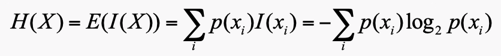
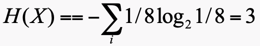
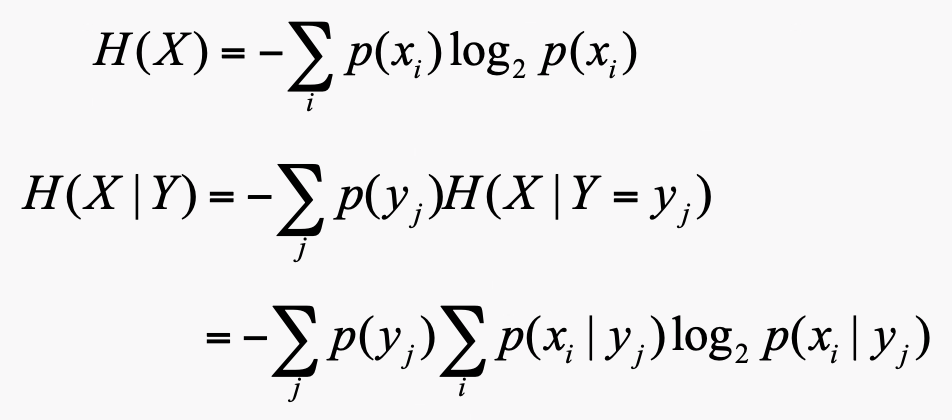

# 决策树

这是一个分类问题：

每一条记录都有一些特征的集合，需要预测结果。

KD-TREE STRUCTURE

## 决策树：

决策树一个二叉树或者多叉树。

在每一个节点，我们根据特征来分割数据。在最后的叶子结点上，我们获得最终的预测结果。

我们从根节点开始，沿着节点找到叶子节点。

## 怎么构建一棵决策树？

### random split

每一段时间，我们找到一个随机的特征，然后分割这棵树根据它的值。

树的高度=特征的数量。

可能是一棵不平衡树。

### 提升

罕见的事件包含更多信息。

所以我们根据事件的概率来定义信息：

I(E) = log~2~(1/p(x)) = -log~2~p(x)

硬币的信息：

I=−log～2～1/2=1
		I =−log～2～1/6=2.58 

**墒**：

信息的期望值：

假设一个特征有8个概率相同的值：

熵度量特征的纯度
纯度越高（值分布不均匀，某些值的概率比其他值大得多），熵越小否则，熵很高（表示特征有许多不同的值）

**条件墒**：

