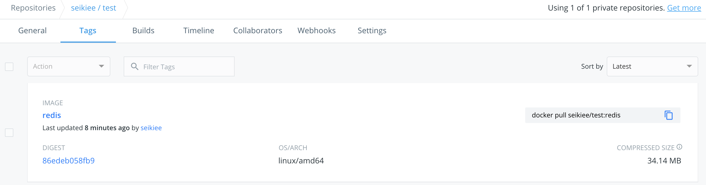

# Docker Hub

## 1. 注册账号

Docker Hub的注册页面：https://hub.docker.com/signup

Docker Hub是免费的, Docker需要填写用户名, 密码和电子邮件地址。


## 2. 新建仓库

在浏览器登陆账号：

在浏览器登陆Docker Hub，创建仓库：

1


2


创建完成：


## 3. 发布镜像

在服务器输入如下命令登陆Docker Hub。

```
docker login --username=<Docker ID>
```

示例图：

登陆用户名为seikiee的账号：


### 3.1 发布已存在的镜像

1. 查看已存在的镜像。

```
docker images
```

示例图：


2. 标记镜像并推送镜像。

```
docker tag <IMAGE ID> <Docker ID>/<repo-name>[:<tag>]
docker push <Docker ID>/<repo-name>
```

示例图：

希望将镜像redis推送到Docker Hub，首先标记该镜像：


推送镜像redis：


推送成功后可以在Docker Hub上查看：




### 3.2 发布正在运行的容器

1. 查看运行容器。

   ```
   docker ps
   ```

   示例图：


2. 将容器制作成镜像并推送镜像。

   ```
   docker commit <CONTAINER ID> <Docker ID>/<repo-name>[:<tag>]
   docker push <Docker ID>/<repo-name>
   ```

   示例图：

   将运行的mysql容器制作成镜像：

   

   推送该镜像：

   

   推送成功后可以在Docker Hub上查看：

   

   

## 4. 使用仓库镜像

```
docker run <CONTAINER ID> <Docker ID>/<repo-name>[:<tag>]
```

## 5. 其他

删除镜像：

```
docker rmi <REPOSITORY>:<TAG>
```

