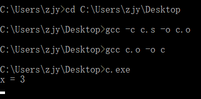

Many language rules are checked by the compiler, and it is possible to bypass the rules using assembly language after compilation. Consider the following C program:

```C
//c.c
#include<stdio.h>

int x=3;

int main(void) 
{ 
  int x=5;
  printf("x = %d\n", x);
}

```

1. Compile the program and generate its assembly code. 

   在终端输入命令

```makefile
gcc -S c.c
```

​	获得汇编代码c.s

```assembly
	.file	"c.c"
	.text
	.globl	_x
	.data
	.align 4
_x:
	.long	3
	.def	___main;	.scl	2;	.type	32;	.endef
	.section .rdata,"dr"
LC0:
	.ascii "x = %d\12\0"
	.text
	.globl	_main
	.def	_main;	.scl	2;	.type	32;	.endef
_main:
LFB11:
	.cfi_startproc
	pushl	%ebp
	.cfi_def_cfa_offset 8
	.cfi_offset 5, -8
	movl	%esp, %ebp
	.cfi_def_cfa_register 5
	andl	$-16, %esp
	subl	$32, %esp
	call	___main
	movl	$5, 28(%esp)
	movl	28(%esp), %eax
	movl	%eax, 4(%esp)
	movl	$LC0, (%esp)
	call	_printf
	movl	$0, %eax
	leave
	.cfi_restore 5
	.cfi_def_cfa 4, 4
	ret
	.cfi_endproc
LFE11:
	.ident	"GCC: (MinGW.org GCC-8.2.0-3) 8.2.0"
	.def	_printf;	.scl	2;	.type	32;	.endef

```


2. Understand the assembly code and modify it to let the program print the global variable `x` instead of the local variable `x`.

   `.globl	_x`中\_x代表一个地址，.globl表明\_x会被链接器使用，需要在目标文件的符号表中标记为一个全局符号。
   
   `.cfi_startproc`和`.cfi_endproc`分别位于汇编函数的开头和结尾，标志函数的起止。
   
   `pushl	%ebp`和`movl	%esp, %ebp`两条指令是将栈顶指向ebp的地址。对寄存器esp做一系列运算之后，定位到x的栈地址，通过`movl	$5, 28(%esp)`将5写入x。栈中存放的是局部变量，代表C语言中的int x=5;语句。`movl	28(%esp), %eax`将x的值放入基地址寄存器eax。`movl	%eax, 4(%esp)`将eax中的值放入4(%esp)。LC0字段存放需要打印的信息。通过`movl	$LC0, (%esp)`和`	call	_printf`
   
   调用打印出x = 5。
   
   因为_x代表全局变量，通过`movl	_x, %eax`将全局变量放到eax中，打印出来的就是全局变量x。修改汇编指令如下：
   
   ```assembly
   	.file	"c.c"
   	.text
   	.globl	_x
   	.data
   	.align 4
   _x:
   	.long	3
   	.def	___main;	.scl	2;	.type	32;	.endef
   	.section .rdata,"dr"
   LC0:
   	.ascii "x = %d\12\0"
   	.text
   	.globl	_main
   	.def	_main;	.scl	2;	.type	32;	.endef
   _main:
   LFB11:
   	.cfi_startproc
   	pushl	%ebp
   	.cfi_def_cfa_offset 8
   	.cfi_offset 5, -8
   	movl	%esp, %ebp
   	.cfi_def_cfa_register 5
   	andl	$-16, %esp
   	subl	$16, %esp
   	call	___main
   	movl	$5, 28(%esp)
   	movl	_x, %eax
   	movl	%eax, 4(%esp)
   	movl	$LC0, (%esp)
   	call	_printf
   	movl	$0, %eax
   	leave
   	.cfi_restore 5
   	.cfi_def_cfa 4, 4
   	ret
   	.cfi_endproc
   LFE11:
   	.ident	"GCC: (MinGW.org GCC-8.2.0-3) 8.2.0"
   	.def	_printf;	.scl	2;	.type	32;	.endef
   ```
   
   检验：
   
   