# PPL

# von Neumann Architecture

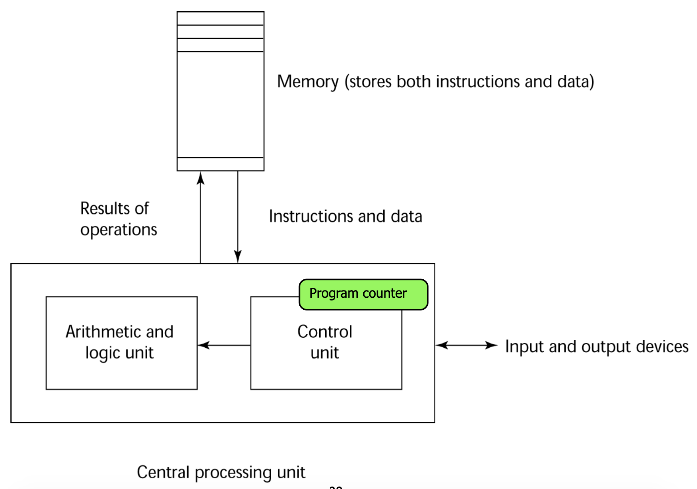

主要的特点：

在内存中存储数据和程序

指令和数据通过管道从内存传输到CPU

每个机器指都有一个fetch-execute-cycle

# Imperative languages

命令式语言：

e.g., C, C++, Java.

主导编程，模仿冯诺依曼结构

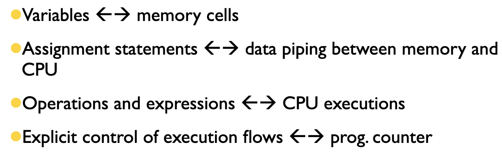

允许在语言和硬件之间进行有效的映射以获得良好的执行性能，但受到von Neumann瓶颈的限制

# Functional languages

函数式语言：

程序就像在解决数学公式一样。

程序及其子程序只是数学函数的实现。

例子：LISP

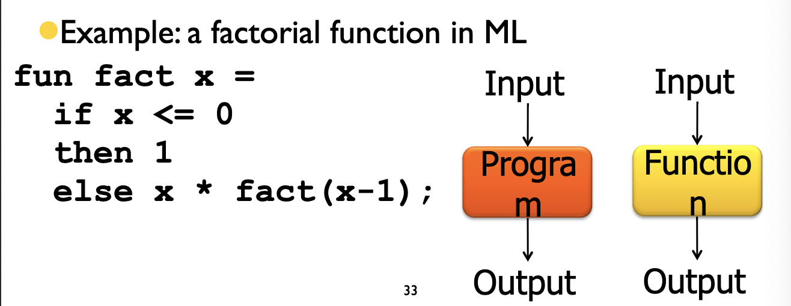

# translation

高级编程语言->汇编语言->机器语言->控制信号

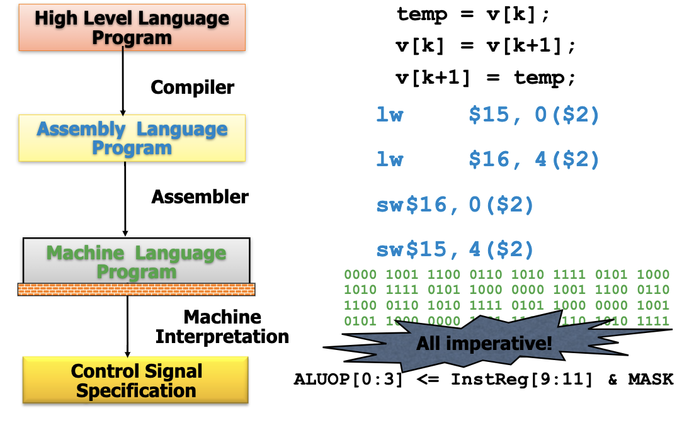

# Logic language

程序就像是logic induction。

Program expressed as rules in formal logic

Execution by rule resolution

Example: relationship among people

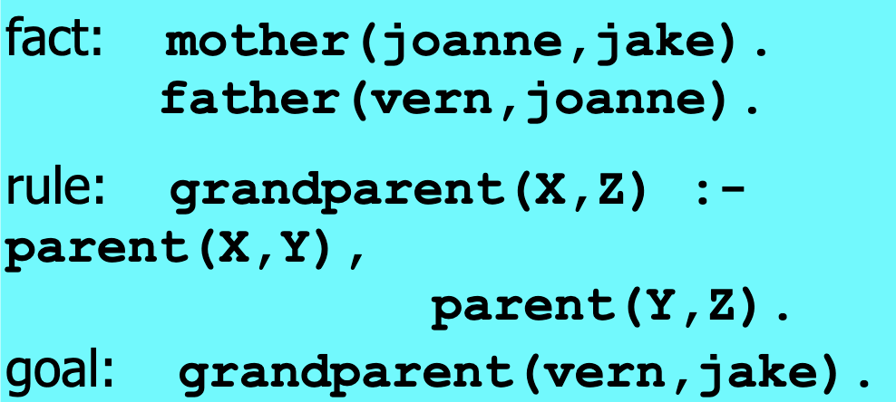

## Logic Programming

Non-procedural：

仅提供相关事实（谓词演算）和推理规则（解决方案）

系统然后推断给定查询/目标的真实性

低效率、小应用领域（数据库、人工智能）

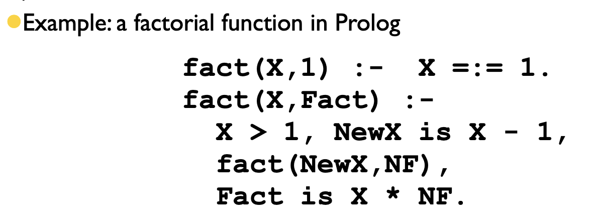

# Summary

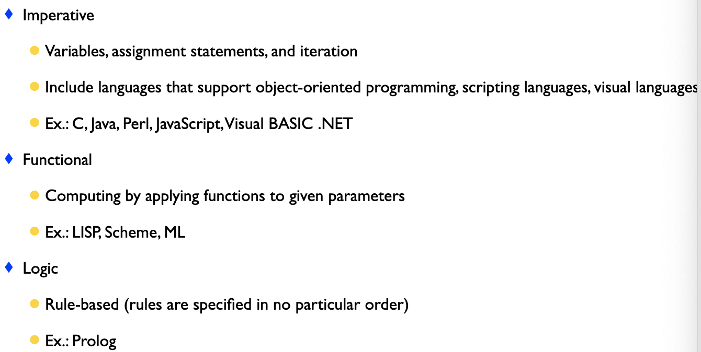

# program language

## important criteria

Readability, writability, reliability, cost

- Readability

  - Control statements

    ​	结构化程序需要足够的控制语句。

  - Data type and structures

    - 定义数据类型和结构的适当工具

  - Syntax considerations

    - 标识符的形式：灵活的构图
    - 特殊词语与复合语句的形成组合statement
    - 形式与意义：自描述性结构，有意义的关键词

- Writability

  - 简单性和正交性，但是，太正交可能会导致未检测到的错误
  - 支持抽象，能够定义和使用复杂的结构或操作而忽略过程中的细节，抽象程序（如子程序）、数据
  - 表达能力强，一组相对方便的指定操作的方法，比如很多现代语句中都含有for。

- Reliability

  - 类型检查，测试类型错误，例如子程序参数
  - 处理exception，中断运行时出错并且采取正确的手段
  - Aliasing，同一内存位置存在两个或多个不同的引用方法
  - 可读性和可写性，不支持“自然”方式表达算法的语言必然会使用“非自然”方法，从而降低可靠性

- 开销

  - 训练程序员使用语言
  - 编写程序（接近特定应用程序）
  - 编译程序
  - 正在执行程序：运行时类型检查
  - 语言实现系统：免费提供编译器
  - 可靠性：可靠性差，成本高
  - 维护程序

## major influence

Major influences on language design have been application domains, machine architecture and software development methodologies

## major method

The major methods of implementing programming languages are: compilation, pure interpretation, and hybrid implementation

实现编程语言的主要方法有：编译、纯解释和混合实现

# BNF❗️

## syntax

syntax语法：the form or structure of the expressions, statements, and program units.

语法是用某种规则定义的。指定如何编写语句、声明和其他语言结构。

## semantics

semantics语义：the meaning of the expressions, statements, and progam units.

就是程序在做什么，它们的行为和意义。

语义更加复杂和复杂。很难定义。

检测语法错误更容易，语义错误更难

## 编译器，以C为例

前端：检查程序是否是C语言的句子。lexical analysis：把C代码转换成相应的“句子”。（intermediate representation，IR）。syntax analysis：检查句子是否是C中的句子。

后端：从“句子”（IR）翻译成目标代码。会做局部和全局优化。代码生成：寄存器和存储分配。

## parse tree

<sentence> -> <noun> <verb> <preposition> <noun>

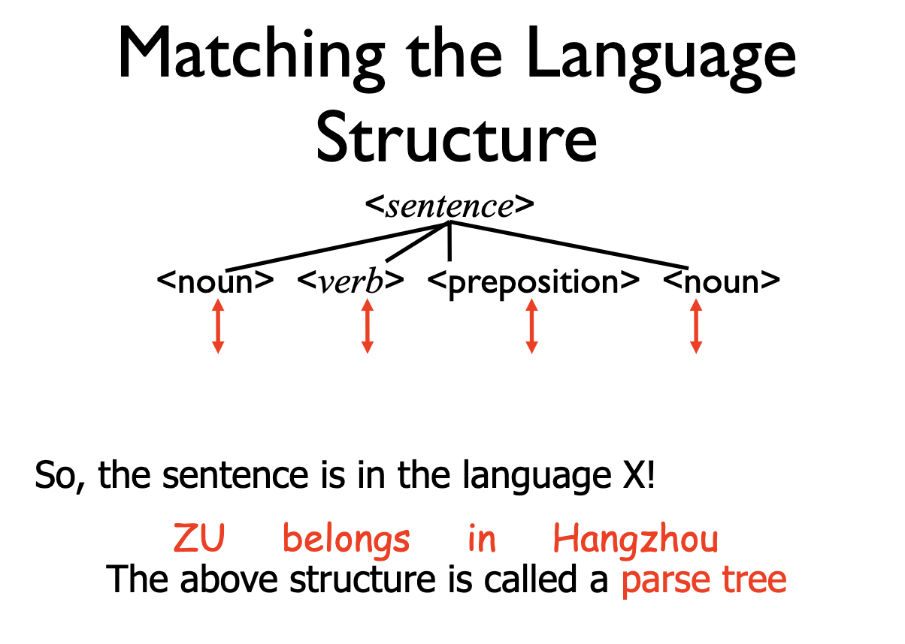

## Formal Description of Syntax

最广为人知的语法描述方法：

Context-Free Grammars：由Noam Chomsky在20世纪50年代中期开发的；定义一类语言：上下文无关语言。

Backus-Naur Form：由约翰·巴克斯发明用来描述ALGOL 58，相当于上下文无关文语法。

## BNF

<number> ::= <digit> | <number> <digit>

：：=是“is defined as"。有些变体用：=来替代。

｜的意思是活着。

尖括号表示非终结符。

不带尖括号的符号是终结符。

## BNF Terminologies

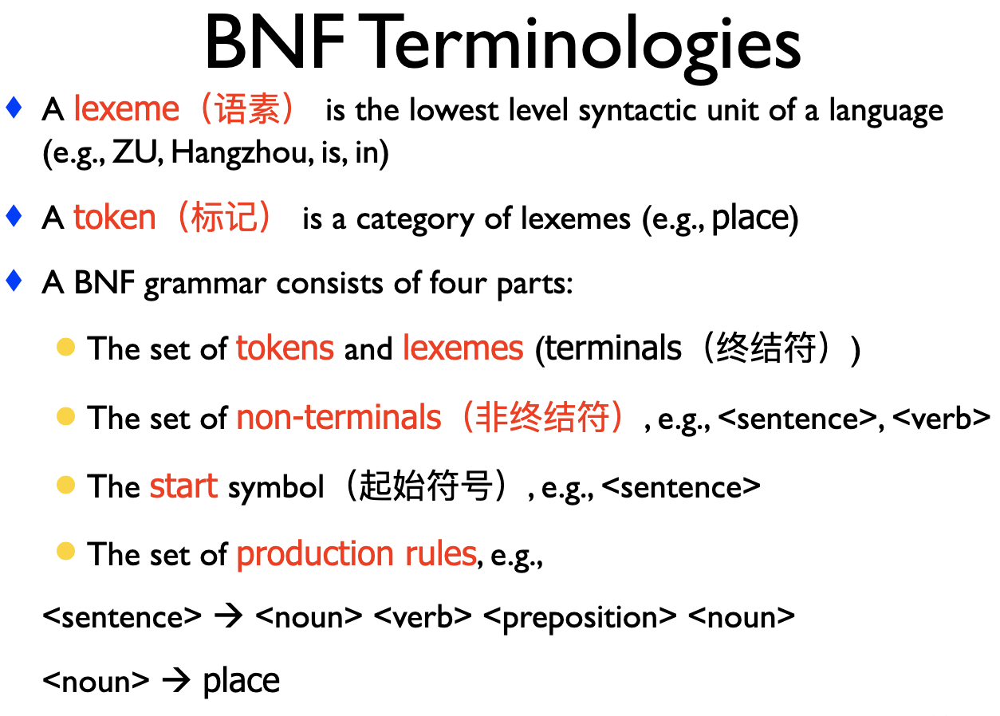

 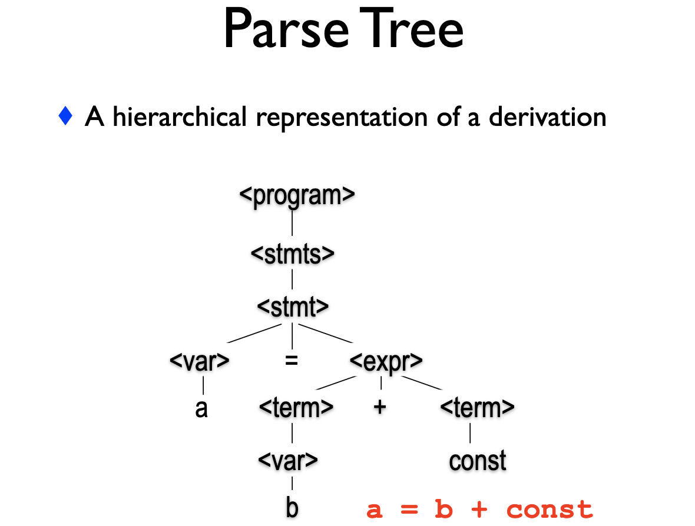

# Bind

## Static Variables

静态变量在执行开始前绑定到内存单元并在整个执行过程中保持，

优点：高效（直接绑定，无运行时分配开销），对于全局可访问变量，历史敏感子程序支持

缺点：缺乏灵活性（无递归），不共享变量之间的存储。在编译时必须知道数据对象的大小。无法动态创建数据结构。

静态内存不支持递归。

## Stack-dynamic Variables

在运行时详细说明声明语句时创建存储绑定

如果是标量，则除address之外的所有属性都是静态绑定的，例如，C子程序和Java方法中的局部变量，是从运行时堆栈中分配的

优点：允许递归，保存所有子项目的存储

缺点：分配和释放开销，子程序不能对历史敏感，无效引用（间接寻址）

## Explicit Heap-dynamic Variables

Java （implicit garbage collection (no free or delete)）

优点：可以建造动态结构

缺点：低效，不可靠，堆管理成本

## Implicit Heap-dynamic Variables

由赋值语句引起的分配和解除分配，不管变量以前用于什么

All variables in APL; all strings and arrays in Perl and JavaScript

优点灵活

缺点：维护动态属性的运行时开销，编译器错误检测丢失

# scope

变量的作用域是其可见的语句的范围

​	如果它可以在该语句中被引用，变量在该语句中可见

程序单元的非局部变量是那些可见但未在其中声明的变量

语言的作用域规则确定对名称的引用如何与变量及其声明相关联

变量范围可以静态确定，基于程序文本和空间概念

要将名称引用连接到变量，您（或编译器）必须找到声明。首先在本地搜索，然后在越来越大的封闭范围内搜索，直到找到给定名称的对象，或者未声明的变量错误

通过具有相同名称的“ closer”变量，可以从单元中隐藏变量。

块：一种在程序单元内部创建新的静态作用域的方法（来自ALGOL 60）

# Dynamic Scope

基于程序单元的调用顺序，而不是其文本布局（时间与空间），只能在运行时确定。

通过在子程序调用链中进行搜索来将变量的引用连接到声明，这些子程序调用将强制执行到这一点。

优点：方便，无需将参数从调用方传递到被调用方

缺点：活动子程序的局部变量对任何其他活动子程序可见。无法静态键入对非本地对象的检查引用。可读性差。对非局部变量的访问时间更长动态范围的评估。

# 范围和生存期

范围和生存期有时紧密相关，但是是不同的概念。

作用域是静态的，对于函数而言是局部的。

生命周期遍及整个程序执行。

# 引用环境

语句的引用环境是该语句可见的所有name的集合。

在静态作用域语言中，它是局部变量加上所有封闭范围中的所有可见变量。

在动态范围的语言中，引用环境是局部变量加上所有active subprogram中的可见变量。如果子程序已经开始执行但尚未终止，则该子程序处于active状态。

# Named Constants

命名常量是绑定到存储时仅绑定一次值的变量。优点：可读性，可修改性，可用于参数化程序。

值与命名常量的绑定可以是静态的（称为清单常量），也可以是动态的。

将变量绑定到值时将其绑定到值称为初始化。通常在声明语句上完成。

# 总结

变量是计算机存储单元的抽象，其特征在于名称，地址，值，类型，生存期，范围！绑定是属性与程序实体的关联：类型和存储绑定！范围确定语句中变量的可见性。

# type

数据类型是一个集合。当确定了一个变量有一个确定的类型，就相当于变量可以具有的值是特定集合的元素，有可以应用于这些值的一组操作。

类型的用途：

程序的组织和文档方面：为区分不同的概念区分不同的类型，表示问题范围的概念；指示声明的标识符的预期用途，类型可以被核对，不像程序评论。

在识别和预防错误方面：编译时或运行时检查可以防止无意义的计算。

支持优化：比如说段证书需要更少的位数，按已知偏移量访问记录组件。

# 原始的数据类型

所有的编程语言都提供一些原始的数据类型。

## 字符串类型

值是字母的序列。

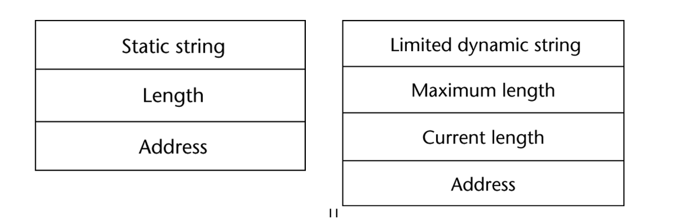

静态字符串需要编译描述符，动态有限字符串需要一个运行时的描述符为了长度。

## User-Defined Ordinal Types

可能的值范围可以很容易地与正整数关联。

### enumerating

定义中提供或列举了所有可能的值（称为常量）。

e.g.,

enum days {mon, tue, wed, thu, fri, sat, sun}; 

增强可读性，例如，无需将颜色编码为数字

增强可靠性，例如，编译器可以检查：

1. 操作，（不允许颜色相加）
2. 不能为枚举变量分配超出其定义范围的值
3. 与C ++相比，Ada，C＃和Java 5.0为枚举提供了更好的支持，因为这些语言中的枚举类型变量不会被强制转换为整数类型

### subrange

有序类型的有序连续子序列。

e.g., 12..18

增强可读性，向读者清楚表明，子范围的变量只能存储一定范围的值。

可靠性：将值分配给超出指定范围的子范围变量检测为错误。

# pointer

指针类型变量的值范围由内存地址和特殊值nil组成

提供间接寻址的能力

提供一种动态管理内存的方式

指针可用于访问动态创建存储（堆）的区域中的位置

# 程序控制结构

## 选择语句

在两个或选择语句在两个或多个执行路径之间进行选择条路径中选择

### two-way

if then else

在当代语言，else子句可以是单个或复合语句

存在嵌套if的情况，else和if的匹配问题：

Java的静态语义规则：else与最接近的if匹配

Perl要求所有then和else子句都必须是复合的，并避免上述问题

也可以通过形成复合语句的替代方法来解决该问题，例如，在Ruby中使用特殊的单词end

### Multiple-way

有静态语义规则，不允许执行多个段。

每个可选段必须以无条件分支（转到或中断）结尾。

## 迭代语句

语句或复合语句的重复执行通过迭代或递归来完成

计数器控制的循环：

计数器迭代语句具有一个循环变量，以及一种指定循环参数的方法：初始值，终端值，步长值

### for

C语言的for循环三条语句，中间是逗号分隔，中间语句缺少就是无限循环。

设计选择：

没有明确的循环变量。

每样东西都会在循环里面改变。

第一个语句值做一遍，其他在循环里面运行。

C++和C不同的点在控制语句可以是布尔的，初始化语句可以包括变量定义。

## 无控制条件的分支

将执行控制权转移到程序中的指定位置，goto。

循环退出语句受到限制，有些隐藏在goto里面。

## Guarded Commands

目的：支持在开发过程中支持验证（正确性）的新编程方法

并发编程的两种语言机制的基础

基本思想：如果评估顺序不重要，则程序不应指定一个

# display

静态链接存储在称为显示的单个数组中

在任何给定时间的显示内容是可访问的激活记录实例的地址列表。

# 并行

没有更多的速度，但是有更多的核心

顺序程序在一个不能从多核中受益的核上运行

并发：一个程序的多个任务同时执行

并行：一个任务分解为多个子任务同时执行，协作完成一个问题

分布式：并行的计算在不同的计算机上进行

