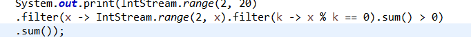
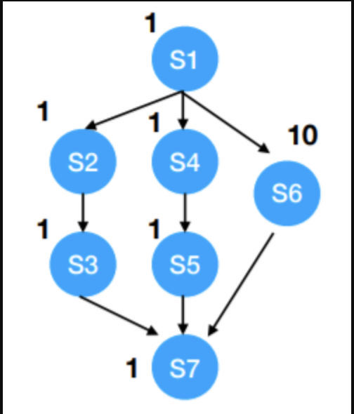

# 2017~2018 学年秋冬学期《程序设计方法学》期末试卷回忆版

授课教师：翁恺老师

1. （8%）第一门结构化编程语言是什么语言？结构化编程的要义是什么？

2. （8%）有一个 BNF 表达式：\<exp\> → \<exp\> + \<exp\> | \<exp\> * \<exp\> | (\<exp\>) | a | b | c
    1. 该表达式有歧义，请举一个例子；
    2. 把该表达式改成没有歧义的。

3. （8%）在程序中定义变量类型对编译器有什么好处？对解释语言，这种好处还存在吗？为什么？

4. （9%）提供以下 Java 函数。

    IntStream.range(a, b)：生成 \[a, b\] 的流；

    Stream.filter(lambda)、Stream.map(lambda)；

    Stream.sum()：把流中的值求和。

    用函数式编程的思想实现 int sum_prime(int a, int b)：求 \[a, b\] 中所有质数的和。要求函数中只能有一条语句，并且不能另外写（用）其它的函数或者类。

    

5. （22%）
    1. 用 Mua（老师发明的一种函数式编程语言）实现递归的快速幂；
    2. 用尾递归的形式把 (1) 中的程序改成迭代的；
    3. 解释器是怎么发现尾递归的；
    4. 如何实现尾递归，以节省内存空间？

6. （10%）

    1. 求上图并行过程的 work 和 span；

       

    2. 求理想加速比；

  7. 如果只有两个核，应该如何调整并行过程，以获得最佳加速效果？

8. （10%）
    1. 把 AR（Activation Record）放在栈里有什么好处？
    2. 把 AR 放在堆里有什么好处？
    3. 如果 C 语言把 AR 放在堆里，用 malloc() 申请堆空间，那么 malloc() 的 AR 放在哪里呢？请设计一种方法解决这个问题。

9. （12%）有以下 Java 函数：solution(x -> x*x*x-x-1, a, b, 1e-3)。函数是用二分法求 lambda 表达式在 [a, b] 中的零点，其中 a 和 b 均为 double，1e-3 表示精度。
    1. 写出该函数的递归实现；
    2. 写出第一个参数的类型定义；
    3. 当 a = 0, b = 4, eps = 0.5 时，写出 (1) 中递归的展开和合并过程；
    4. 如果没有零点，应该如何让 solution 的调用者知道。

10. （8%）JVM 中有 method area 和 heap。
    1. 两个空间中分别存放什么内容？
    2. 加载一个类后，两个空间中分别存放什么内容？哪个空间会有指针指向另一个空间？（这两题看起来很像，我也不知道老师是什么意思...我两题回答基本相同- -）

11. （5%）这门课你最失望的地方是什么？你本来想听到哪些内容，但课堂上却没有提及？你认为这门课最精彩的地方是什么？

常量池存储一些树脂类型方法的应用。有利于动态连接

命令式编程⻛格常常迫使我们出于性能考虑，把不同的任务交织起来，以便能够用一次循环来完成多个任务

而函数式编程用map()、filter()这些高阶函数把我们解放出来，让我们站在更高的抽象层次上去考虑问题，把问题看得更清楚