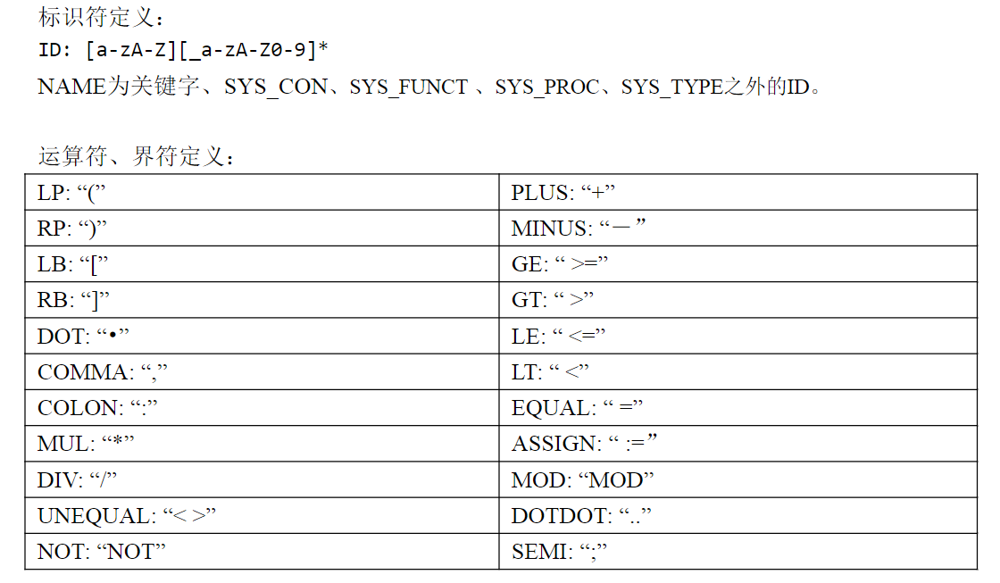
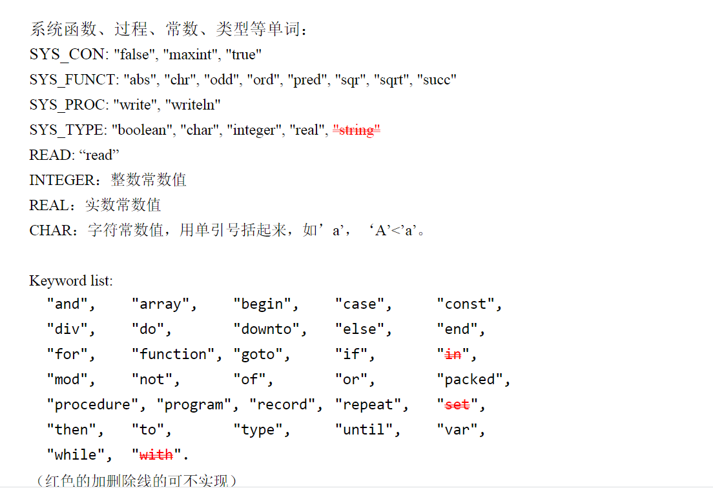

## 语法规则

program ：program_head  routine  DOT

program_head ：PROGRAM  ID  SEMI

routine ：routine_head  routine_body

sub_routine ：routine_head  routine_body

routine_head ：label_part  const_part  type_part  var_part  routine_part

label_part ：ε

const_part ：CONST  const_expr_list  |  ε

const_expr_list ：const_expr_list  NAME  EQUAL  const_value  SEMI|  NAME  EQUAL  const_value  SEMI

const_value ：INTEGER  |  REAL  |  CHAR   |  SYS_CON（这里去掉了一个STRING)

type_part ：TYPE type_decl_list  |  ε

type_decl_list ：type_decl_list  type_definition  |  type_definition

type_definition ：NAME  EQUAL  type_decl  SEMI

type_decl ：simple_type_decl  |  array_type_decl  |  record_type_decl

simple_type_decl ：SYS_TYPE  |  NAME  |  LP  name_list  RP  

​				|  const_value  DOTDOT  const_value  

​				|  MINUS  const_value  DOTDOT  const_value

​				|  MINUS  const_value  DOTDOT  MINUS  const_value

​				|  NAME  DOTDOT  NAME

array_type_decl ：ARRAY  LB  simple_type_decl  RB  OF  type_decl

record_type_decl ：RECORD  field_decl_list  END

field_decl_list ：field_decl_list  field_decl  |  field_decl

field_decl ：name_list  COLON  type_decl  SEMI

name_list ：name_list  COMMA  ID  |  ID

var_part ：VAR  var_decl_list  |  ε

var_decl_list :  var_decl_list  var_decl  |  var_decl

var_decl :  name_list  COLON  type_decl  SEMI

routine_part:  routine_part  function_decl  |  routine_part  procedure_decl

​			|  function_decl  |  procedure_decl | ε

function_decl : function_head  SEMI  sub_routine  SEMI

function_head :  FUNCTION  NAME  parameters  COLON  simple_type_decl 

procedure_decl :  procedure_head  SEMI  sub_routine  SEMI

procedure_head :  PROCEDURE NAME parameters 

parameters ：LP  para_decl_list  RP  |  ε

para_decl_list ：para_decl_list  SEMI  para_type_list | para_type_list

para_type_list ：var_para_list COLON  simple_type_decl  |  val_para_list  COLON  simple_type_decl

var_para_list ：VAR  name_list

val_para_list ：name_list

routine_body ：compound_stmt

compound_stmt ：BEGIN  stmt_list  END

stmt_list ：stmt_list  stmt  SEMI  |  ε

stmt ：INTEGER  COLON  non_label_stmt  |  non_label_stmt

non_label_stmt ：assign_stmt | proc_stmt | compound_stmt | if_stmt | repeat_stmt | while_stmt | for_stmt | case_stmt | goto_stmt

assign_stmt ：ID  ASSIGN  expression| ID LB expression RB ASSIGN expression| ID  DOT  ID  ASSIGN  expression

proc_stmt ：ID |  ID  LP  args_list  RP |  SYS_PROC |  SYS_PROC  LP  expression_list  RP |  READ  LP  factor  RP

if_stmt ：IF  expression  THEN  stmt  else_clause

else_clause ：ELSE stmt |  ε

repeat_stmt ：REPEAT  stmt_list  UNTIL  expression

while_stmt ：WHILE  expression  DO stmt

for_stmt ：FOR  ID  ASSIGN  expression  direction  expression  DO stmt

direction ：TO | DOWNTO

case_stmt ：CASE expression OF case_expr_list  END

case_expr_list ：case_expr_list  case_expr  |  case_expr

case_expr ：const_value  COLON  stmt  SEMI

​			|  ID  COLON  stmt  SEMI

goto_stmt ：GOTO  INTEGER

expression_list ：expression_list  COMMA  expression  |  expression

expression ：expression  GE  expr  |  expression  GT  expr  |  expression  LE  expr

​			|  expression  LT  expr  |  expression  EQUAL  expr  

​			|  expression  UNEQUAL  expr  |  expr

expr ：expr  PLUS  term  |  expr  MINUS  term  |  expr  OR  term  |  term

term ：term  MUL  factor  |  term  DIV  factor  |  term  MOD  factor |  term  AND  factor  |  factor

factor ：NAME  |  NAME  LP  args_list  RP  |  SYS_FUNCT | SYS_FUNCT  LP  args_list  RP  |  const_value  |  LP  expression  RP |  NOT  factor  |  MINUS  factor  |  ID  LB  expression  RB |  ID  DOT  ID

args_list ：args_list  COMMA  expression  |  expression

## 词法规则

SPL语义规则：

1. 函数参数前面加var的表示该参数值可变可回传，即引用传递。

2. Function名称也是该函数返回的变量

