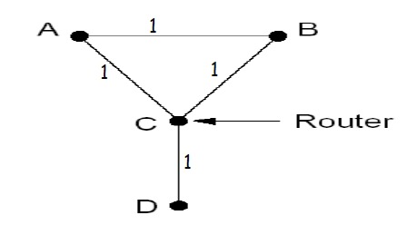

# 3170103240-张佳瑶-作业五

# 1

	>Give two example computer applications for which connection-oriented service is appropriate. Now give two examples for which connectionless service is best. 

1. two examples about connection-oriented service

   1.1 real-time traffic such as transfer voice file and video

   1.2 remote login, SSH

2. two examples about connectionless service

   2.1 credit card verification

   2.2 electronic funds transfer

   2.3 remote database visit

# 2

>Consider the network of Fig. 5-12(a). Distance vector routing is used, and the following vectors have just come in to router *C: from B: (5, 0, 8, 12, 6, 2); from D: (16, 12,* 6, 0, 9, 10); and from *E: (7, 6, 3, 9, 0, 4). The cost of the links from C to B, D, and E,* are 6, 3, and 5, respectively. What is C􏰊's ne􏰉w routing table? Gi􏰏ve both the outgoing line to use and the cost. 

Initially, C's routing table is (-, 6, 0, 3, 5, -). After reveiving routing tables from B, D, E, the C's new routing table is (11, 6, 0, 3, 5, 8).

| Destination | From C | Route   |
| ----------- | ------ | ------- |
| A           | 11     | C->B->A |
| B           | 6      | C->B    |
| C           | 0      | C->C    |
| D           | 3      | C->D    |
| E           | 5      | C->E    |
| F           | 8      | C->B->F |

 

# 3

>Please give an example in which the poisoned reverse technique cannot prevent the **count-to-infinity** problem and explain why. 

If the link between C and D is broken, A and B can't receive update message at the same time. The following events will happen in turn.

1. A receive the bad message from C and select a path from B to D.
2. A send a new message to C.
3. C send a new message to B.
4. After a long time, A and B catch the bad message about the link between C and D.

# 4

>A router has just received the following new IP addresses: 57.6.96.0/21, 57.6.104.0/21, 57.6.112.0/21, and 57.6.120.0/21. If all of them use the same outgoing line, can they be aggregated? If so, to what? If not, why not? 

They can be aggregated to 57.6.96.0/19.

# 5

>The set of IP addresses from 29.18.0.0 to 29.18.128.255 has been aggregated to 29.18.0.0/17. However, there is a gap of 1024 unassigned addresses from 29.18.60.0 to 29.18.63.255 that are now suddenly assigned to a host using a different outgoing line. Is it now necessary to split up the aggregate address into its constituent blocks, add the new block to the table, and then see if any reaggregation is possible? If not, what can be done instead? 

it is not necessary to split up the arregate address. it is sufficient to add ine new table entry: 29.18.0.0/22 for a new block. if an incoming packet matches both 29.18.0.0/17 and 29.18.0.0/22, the longest one wins. this rule makes it possible to assign a large block to one outgoing line but make an exception for one or more small blocks within its range.

# 6

>A router has the following (CIDR) entries in its routing table: 
>
>Address/mask Next hop
>
>135.46.56.0/22 Interface 0
>
>135.46.60.0/22 Interface 1 
>
>192.53.40.0/23 Router 1 
>
>default Router 2 
>
>For each of the following IP addresses, what does the router do if a packet with that address arrives? 
>
>(a) 135.46.63.10 
>
>(b) 135.46.57.14 
>
>(c) 135.46.52.2 
>
>(d) 192.53.40.7 
>
>(e) 192.53.56.7 

56: 00111000

60: 00111100

40: 00101000

63: 00111111

57: 00111001

52: 00110100

(a) the packet will come to Interface 1.

(b) the packet will come to Interface 0.

(c) the packet will come to Router 2.

(d) the packet will come to Router1.

(e) the packet will come to Router 2.

# 7

>When the IPv6 protocol is introduced, does the ARP protocol have to be changed? If so, are the changes conceptual or technical? 

There is no need to make any changes, only the IP address needs more space.

# 8

>Consider the user of differentiated services with expedited forwarding. Is there a guarantee that expedited packets experience a shorter delay than regular packets? Why or why not? 

there is no guarantee. if too many packets are expedited, the channel may performances worse than the regular.

# 9

>A token bucket scheme is used for traffic shaping. A new token is put into the bucket every 5 μsec􏰐􏰎􏰌􏰑. Each token is good for one short packet, which contains 48 bytes of data. What is the maximum sustainable data rate? 

With a token every 5 μsec, 200,000 cells/sec can be sent. Each packet holds 48 data bytes or 384 bits. The net data rate is then 76.8 Mbps.

76.8 Mbps = 200,000 cells/sec * 384 bits