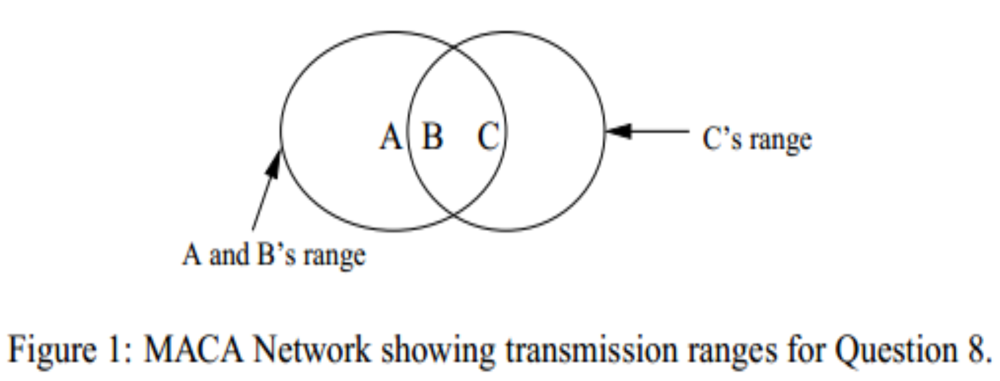

# 3170103240-张佳瑶-作业四

# 1

> A group of N stations share a 56-kbps pure ALOHA channel. Each station outputs a 1000-bit frame on average once every 100 sec, even if the previous one has not yet been sent (e.g., the stations can buffer outgoing frames). What is the maximum value of N? 

The best utilization of pure ALOHA is 1/2e.

So the best bandwith is 56 / 2e = 10.3kbps.

Each staion can send 10bit frame once 1 second.

10.3kbps / 10bit = 1030

So the maximum value of N is 1030.

# 2

>Consider the delay of pure ALOHA versus slotted ALOHA at low load. Which one is less? Explain your answer. 

At low load, the delay of pure ALOHA is less.

Low load means less collision. Pure ALOHA can send frame whenever it wants. But the slotted ALOHA always needs to wait for next slot. The slotted ALOHA has to spend more delay.

# 3

>Sixteen stations, numbered 1 through 16, are contending for the use of a shared channel by using the adaptive tree walk protocol. If all the stations whose addresses are prime numbers suddenly become ready at once, how many bit slots are needed to resolve the contention? 

6 stations: 2 3 5 7 11 13

slot1: 2 3 5 7 11 13

slot2: 2 3 5 7

slot3: 2 3

slot4: 2

slot5: 3

slot6: 5 7

slot7: 5

slot8: 7

slot9: 11 13

slot10: 11

slot11: 13

So 11bit slots are needed to resolve the contention.

# 4

>Six stations, A through F, communicate using the MACA protocol. Is it possible for two transmissions to take place simultaneously? Explain your answer. 

It is possible for two transmissions to take place simultaneously. Put the stations in a straight line and each station can send frames to its nearest neighbor. A sends frame to B when E sends F.

# 5

>Consider building a CSMA/CD network running at 1Gbps over a 1- km cable with no repeaters. The signal speed in the cable is 200,000 km/sec. What is the minimum frame size? 

t  = 1km/200,000 km/sec = 5*10^-6^ s

Frame size = 2 * 5*10^-6^ * 1G = 10000bits

the minimum frame size is 10000bits.

# 6

>1. Please show the differences between
>    (a) The Ethernet CSMA/CD protocol and the 802.11 CSMA/CA protocol 
>
>   (b) The MACA protocol and the 802.11 CSMA/CA protocol 

(a)

以太网CSMA/CD在传输过程中监听信道，如果读回的信号不同于它放到信道上的信号，则发现发生了碰撞，立即停止传输。这样，发射机制不浪费大量时间继续传输最后的信息。在等待一段随机的时间后再传输。

802.11 CSMA/CA侦听信道是否繁忙，等到空闲的时候，不立刻发出帧，而是后退一段随机的时间，开始倒计时，倒计时到0的时候，就发送帧。早期的后退有助于避免冲突，利用确认推断是否发生了冲突。

(b)

MACA无助于解决暴露终端问题的解决，可以解决隐藏终端的问题。

但是隐藏终端的问题很少，802.11 CSMA/CA通过后退发送失败的站来幻觉隐藏终端的问题，使得传输更可能取得成功。带物理侦听和虚拟侦听的CSMA/CA是802.11协议的核心。

# 7

>An unscrupulous host, A, connected to an 802.3 (Ethernet) network biases their implementation of the binary exponential backoff algorithm so they always choose from {0,1} after a collision, in any situation. Another host, B, is trying to send a frame at the same time as A. Assuming A and B collide exactly three times before one of their transmissions succeeds, what are the odds that B sends its frame before A(as opposed to A sending before B)? 

A:

The first backoff is between 0 and 1.

The second backoff is between 0 and 1.

The third backoff is between 0 and 1.

B:

The first backoff is between 0 and 1.

The second backoff is among 0, 1, 2, 3.

The third backoff is among 0, 1, 2, 3, 4, 5, 6, 7.

The forth backoff is among 0-2^4^-1.

1/2 * 1/4 * 1/8 * 1/2 * 1/16 = 0.04883%

# 8

>Consider the following wireless network, where the circles are showing transmission ranges, and the presence of a host (letter) in a particular circle indicates it can hear that transmitter. If hosts A and C are both trying to send to host B will they encounter the hidden or exposed station problems? Does the MACA protocol help in this situation? 
>
>

A可以侦听到B和C。C可以侦听到B，但不能侦听到A。

当A先侦听介质，发现空闲，可以发送传输。C开始侦听，但听不到A的帧，误以为不会发生冲突，而向B发送帧。于是产生隐藏终端的问题。

MACA可以解决这个问题。A、C向B发送RTS包，A听到了C的发送的RTS包，就会保持安静。如果A先发送RTS包，B回复一个CTS包，这个CTS包会被C听到，于是C就会保持安静。这样就解决了隐藏终端的问题。

# 9

>Consider the extended LAN connected using bridges B1 and B2 in Fig. 4-41(b). Suppose the hash tables in the two bridges are empty. List all ports on which a packet will be forwarded for the following sequence of data transmissions:
>
>(a) A sends a packet to C. 
>
>(b) E sends a packet to F.
>
>(c) F sends a packet to E. 
>
>(d) G sends a packet to E.
>
>(e) D sends a packet to A. 
>
>(f) B sends a packet to F 

（a）B1将在端口2、3和4上转发此数据包，B2将在1、2和3号转发此数据包

（b）B2将在端口1、3和4上转发此数据包，B1将在1、2和3转发此数据包。

（c）B2不会在其任何端口上转发此数据包，B1也不会看到它。

（d）B2将在端口2上转发此数据包，B1看不到它。

（e）B2将在端口4上转发此数据包，B1将在端口1上转发此数据包。

（f）B1将在端口1、3和4上转发此数据包，B2会在2号端口转发此数据包。