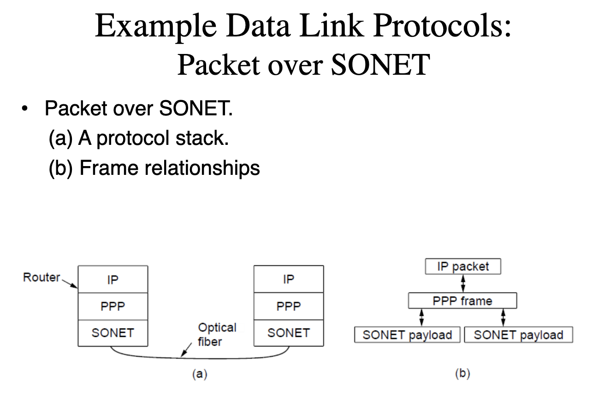
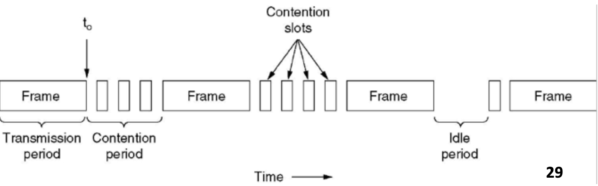

# the data link layer

偶校验：

当实际数据中“1”的个数为偶数的时候，这个校验位就是“0”，否则这个校验位就是“1”

## byte count

要把这个校验码的帧也算进去的。

## hamming code

r位校验位的Hamming code，可以检测1+2+4+...+2r-1 = 2r-1位上的单个错误。

实际中判断需要多少位校验码的时候，是自己的位数加上r是小于等于2r-1。

## crc也叫多项式校验码

只要G（X）具有多个项，就可以检测到所有单个错误。

双个错误检测：多了

带r和校验位的多项式编码可以监测到所有长度小于等于r的突发错误。

## 基本数据链路层协议

### A Utopian Simplex Protocol 协议一 无反馈，单方向发送数据

一个乌托邦的协议。

三个假设：

物理层、链路层和网络层独立。

机器A用一个可靠的、面向连接的协议传输stream。

机器不会crash。

数据是==单方向传输==的；channel不会被毁坏也不会丢帧；网络层时刻都处于ready的状态；处理时间可以忽略，处理时间有在接收到包的时候计算一下校验码；有无限长的buffer。

==接收方不会给出反馈==

### A Simplex Stop-and-Wait Protocol 协议二（接收方针对流量控制给出ack）

一个简单的停-等协议：

假设通信信道==不会出错==。

发送者时刻准备。

接受者不是时刻准备好，接受者有buffer限制。

发送方只需将==延迟==插入协议1中，以充分降低延迟，以防止接收方陷入沼泽。 →带宽利用率低。 

接收者向发送者提供反馈，允许发送者发送下一帧，ack。

==相当于增加了流量控制==

### A Simplex Protocol for a Noisy Channel 协议三（加上接收方针对数据出错给出NAK反馈，流量控制）多了一个timeout

communication channel会有差错。

接受者不是时刻都准备好的。

发送者在前进到下一个数据项之前等待肯定确认的协议通常称为PAR（带重传的肯定确认）或ARQ（自动重复请求）

Positive acknowledgment with retransmission

or automatic repeat request

ARQ增加了==差错控制==：

接受者发送ack如果正确。

发送者使用一个计时器，如果没有ack就重传。

帧和ack都是有编号的，1bit就够用了（两个数字）。

ack丢失，会无视发送过来的重复数据包。

### 滑动窗口协议 协议四 双工 停等

#### 基本信息准备

丢失帧或过早超时的组合不会导致协议将重复数据包传递到网络层，或跳过数据包，或陷入死锁。

下面是利用传输和延迟的时间来计算==信道利用率utilization==。

Tframe：传输帧。帧的大小除以比特率。

Tprop：延时。data一个，ack一个。有两个。距离除以信号的速度。

==Mbps：Million bits per second==

==1Gbps = 1000Mbps==

确认帧如果是捎带传回，就说明传回来的是一个完整的数据帧，所以要给时间再加上一个传输帧的时间。因为单单传输余个数据帧不需要那么多时间。

窗口大小=允许发送/接受的sequence number的集合。

发送窗口：

Sender window increases when ackreceived

发件人窗口中的数据包必须在源位置缓冲

在某些协议中，发送方窗口可能会增长

#### Piggybacking

携带数据。B方向A方发送数据时携带ACK。

#### Sliding Window (Transmitter)

发送方：发送一个帧，上限+1；收到1个ack，下限加一。

接受方：如果收到，且发送了ack，上下限都加一。

这里是3-bit sequence number：从0-7，一共有8个。

a是初始状态：发送方两个指针都指向0，没有发送过数据。接收方等待着序号为0 的帧。

b是发送了一个帧：发送方变成（0，1），意味着它发了一个0号帧。接收方还是在等这个0号帧。

c是接收方瘦了一个帧，但是发送方还没看到ack。

d是发送方看到了ack。

发送者发了之后就缩短，收到ack后增长。接收方收到之后就缩短，发送ack之后就增长。

ack3说明0-2的都收到了，期待3号帧，收到3个帧了。

## 协议五 A protocol using go back N

Receive Window Size=1

Send Window Size <= MAX_SEQ (0...N)

意思就是说序号是到5的，发送方窗口大小最大也只能是5。

因为有6个的话，你就不知道这个0可以被赋给旧的重传或者是新的。错误的当成是新的之后就会发送一波新的帧，引起错误。

超时重传。

ack的号码就是收到的号码。

没有NACK的反馈，只有没收到ack，timeout之后会根据之前收到的ack推断一下，重传需要重传的包。

## 协议六 A protocol using selective repeat 选择重传

Send Window Size <= (MAX_SEQ+1)/2

Receive Window Size = Send Window Size

## Packet over SONET

## ADSL (Asymmetric Digital Subscriber Loop) 非数字环路

## PPP point-to-point protocal

一种称为PPP（点对点协议）的标准协议用于通过链路发送数据包，包括SONET光纤链路和ADSL链路。

1. 一种成帧方法，它明确地描述一帧的结束和下一帧的开始。帧格式还处理错误检测。
2. 一种链路控制协议（LCP），用于在不再需要的情况下，使线路上升、测试、协商选项并再次优雅地下降。
3. 以独立于要使用的网络层协议的方式协商网络层选项的一种方法。==所选择的方法是为支持的每个网络层具有不同的NCP（网络控制协议，网络控制协议）。==

开头是两个flag成帧。

协议表示payload里面是什么数据包。

采用CRC校验码。

具体例子：

PC首先通过调制解调器呼叫ISP的路由器。路由器的调制解调器接听电话并建立物理连接。PC在一个或多个PPP帧的有效载荷字段中向路由器发送一系列LCP包。这些包及其响应选择要使用的PPP参数。一旦参数达成一致，就会发送一系列NCP包来配置网络层。（DHCP，NAT）–现在，PC是一个Internet主机，可以发送/接收IP数据包。典型场景（释放连接）-当用户完成时，NCP会断开网络层连接并释放IP地址。–然后LCP关闭数据链路层连接。–最后，计算机告诉调制解调器挂断电话，释放物理层连接。

## 课后习题

With a 50-kbps channel and 8-bit sequence numbers, the pipe is always full. The number of retransmissions per frame is about 0.01. Each good frame wastes 40 header bits, plus 1% of 4000 bits (retransmission), plus a 40-bit NAK once every 100 frames. The total overhead is 80.4 bits per 3960 data bits, giving 80.4/(3960 + 80.4) = 1.99%.

==The notation is **(seq, ack, info).**==

# MAC

## channel分配问题

有两种网络的类型：point-to-point connection\bradcast channels

## Staticchannel allocation

传统的在多个竞争用户之间分配单信道的方法是频分复用。当用户数量较少且固定时，每个用户都有很重的（缓冲的）流量负载，FDM是一种简单而有效的分配方式，◆当发送方数量较大且不断变化或流量较大时，FDM存在一些问题

## s TDM (Time Division Multiplexing)

## 动态信道分配

### 5个假设

1. 独立传输。模型由N个独立的station组成，独立产生要传输的帧。
2. 单信道假设。一个单信道足够communicate
3. 冲突假设
4. 时间假设(a) Continuous Time.(b) Slotted Time
5. 载波假设(a) Carrier Sense.(b) No Carrier Sense

### 多访问协议

#### ALOHA

Let users transmit whenever they have data to be sent. There will be collisions and the colliding frames will be destroyed. The sender just waits a random amount of time and sends it again if a frame is destroyed.

想发就发，错了重传。

Two types of ALOHA:

◼Pure ALOHA: ames are transmitted at completely arbitrary times

◼Slotted ALOHA: 

时间是分槽的。计算机没有被允许在任意时间发送。要求等到下一个发送槽的开始时间。

==The vulnerable period is halved for Slotted ALOHA==

#### CSMA载波侦听多路访问协议 Carrier Sense Multiple Access Protocols

==两种：CSMA (Carrier Sense Multiple Access) without CD(Collision Detection)/CSMA with CD==

###### without CD

**persistent CSMA**

发之前侦听信道：如果空闲，就发送；如果忙碌，就等到它空闲就传输。如果冲突发生了，就等待一个随机的时间，再重复一遍。

该协议被称为1-persistent，因为当站点发现信道空闲时，它以1的概率进行传输。

◆有可能在一个站点开始发送后，另一个站点将准备发送和感知信道。◆如果第一个站点的信号尚未到达第二个站点，则后者将感知空闲信道并开始发送，导致碰撞。◆这种可能性取决于适合信道的帧数，或信道的带宽延迟（BD）乘积◆低BD乘积→小碰撞几率◆大BD乘积→高碰撞几率

◼优于ALOHA

**Non-persistent CSMA**

发送前，电台感知频道。◆如果频道空闲，电台发送帧。◆如果频道正在使用，电台不会持续感知它。相反，它会等待一个随机的时间段，然后重复算法。◆如果发生碰撞，工作站会等待一个随机的时间段，然后重新开始。

比1-持久CSMA延迟更长。

**p-persistent CSMA**

信道是要分槽的。每个时隙正好恰好与传输一个数据包所需的时间相等

在发送之前，站点感测信道：⚫如果信道空闲，则以概率p发送。如果概率q=1-p，则延迟到下一槽。

⚫如果该时隙也空闲，则再次发送或延迟，在概率为p和q.

⚫重复该过程，直到帧已被发送或另一个站已开始发送为止。

⚫如果信道正忙，则等待下一个槽并应用上述算法。

IEEE 802.11使用p-持久CSMA的改进

###### with CD

是对没有冲突检测的carrier sense multiple access protocol的提升。

只要station检测到一个冲突，就停止传输。

==CSMA/CD can be in one of three states: contention, transmission, or idle.==

==三种状态==：

- 竞争
- 传输
- 空闲

在最坏的情况下，一个电台在没有听到碰撞声的情况下传输2τ之前，不能确定它是否已经占用了信道。这里τ是信号在两个最远的站之间传播的时间

### Collision free protocols

#### A Bit-Map Protocol 基本位图协议

每个竞争周期由N个槽组成。

In general, station 𝑖inserts 1 in time slot 𝑖in order to send data.

N：N位竞争周期。 例如上面的01234567，N就是8。

低载的情况下：

低序号的槽：等待当前扫描的N/2个槽，再等待下一个扫描的N个槽。高序号等待半个扫描周期：0.5个槽。

平均等待就是一个槽N。

高载的情况下：

N位竞争周期被分摊到N个帧上。

#### Token passing

拿到token后，要发送帧就要在传递token前面先把帧发出去。

**token ring**

令牌环协议，这些站点在一个环中一个接一个地连接起来。将令牌传递到下一个站点，然后简单地包括从一个方向接收令牌并将其从另一个方向发送出去。这样它们将在环中循环并到达目的地的任何站点。◼因为循环中的所有位置都是等效地，对低或高编号的站没有偏见。

**token bus**

#### Binary Countdown

希望使用该频道的电台现在将其地址作为二进制位字符串广播，从高阶位开始。假设所有地址的长度相同。◼来自不同站点的每个地址位置中的位在同一时间发送时由信道一起布尔或。就是信道会把这两个一块发的帧做一个或运算。◼为了避免冲突，必须应用仲裁规则：只要站点看到其地址中为0的高阶位位置已被覆盖如果是1，它就会放弃。

## Limited-Contention protocols

有竞争的协议（ALOHA、CSMA）在低负载的情况下表现良好；无竞争的协议（就是冲突避免的那些协议）在高负载的情况下表现良好。

### Adaptive Tree Walk Protocol

## Wireless LAN Protocols 无限局域网协议

能监听到的是另一码事。

### Hidden station problem (隐藏终端问题

监听不到对方，但是不能同时发。

竞争者离得太远而无法检测到潜在的竞争者。

### Exposed station problem (暴露终端问题)

可以监听到对方，但是可以同时发。

肯定是不发给同一个对象

实际上没有影响的被错误的当成了有影响的。

### The MACA (Multiple Access with Collision Avoidance)

Collision detection can take as long as 2t。

包里放上帧的长度，来计算发送时间，也就是等待时间。

## IEEE 802.3 以太网协议 以太网物理层

 802.3标准描述了一个1- persistent CSMA/CD，在各种介质上以1到10 Mbps的速度运行。（802.3标准）

经典的以太网的布线：

Manchester encoding (used by Ethernet):0: low-high;                    1: high-low;

Differential Manchester encoding (used by Token Ring):0: presence of transition;  1: absence of transition49

这个是我后面那段跟前一个clock的后半段一致，就是0；不一致就是1。

## 以太网MAC子层

Preamble：8 bytes，10101010用来同步。

首地址和尾地址都是6 bytes。单播/广播/组播地址

Type field or length field

Data: 1500 bytes (maximum),  46 bytes (minimum)

Checksum: 32 bits, CRC

All frames must take more than 2t to send. 因为传输完了但冲突了，这个冲突还没返回到发送方，发送方就认为自己已经成功传输好了。就会产生错误。

最小的帧长应该是64byte

## ==Binary Exponential Backoff Algorithm==

以太网的算法，二进制回退

1. 时间分成离散的slot

2. After the 1stcollision, each station waits either 0 or 1 (kin 0~21-1) slot times before trying again.
3. After the 2ndcollision, each station picks either 0,1,2,3 (kin 0~22-1) at random and waits that number of slot times.
4. After i-thcollisions, each station picks either 0,1,2,..., 2𝑖−1at random and waits that number of slot times.
5. After 16 consecutive collisions,  the controller reports failure back to the computer.→limited contention.

## CSMA/CA

带有冲突避免的CSMA。

用在802.11的无限局域网里。

IEEE 802.11 (WIRELESS LANs)

## The 802.11: Sublayer Protocol

DCF

PCF

## Data link layer switching

### bridge

bridge的用处：

由主干网连接的多个局域网，以处理总负载高于单个局域网的容量。

bridge连接两个局域网。

bridge（和hub）连接七个点到点station

learning bridge

第一个802网桥是一个学习网桥或透明网桥。该表可以列出每个可能的目的地，并告诉它属于哪个输出线（LAN）。◼当帧到达时，网桥必须决定是丢弃还是转发它，如果是后者，则在哪个LAN上放置帧

当第一个桥第一次插入时，所有哈希表都是空的。没有一个桥知道任何目的地在哪里，所以它们使用==泛洪算法==。

随着时间的推移，桥会知道目的地在哪里。（backwardlearning）◆每当源已经在表中的帧到达时，它的条目就会随着当前时间更新。（时间更新）◆桥中的进程定期扫描哈希表并清除几分钟前的所有条目。（老化)

转发帧：

目的地和出发地相同，就忽视；

目的地和出发地不同，就转发；

目的地不知道，就泛洪。

## 各种连接器

Bridges设计出来用来连接不同的LAN。switches是现代bridge的另一个名字，他有更多的端口，更常见。

路由器用包的头来选择输出线，路由算法有RIP、OSPF。

Qos。

网关连接两个计算机。

# 物理层

